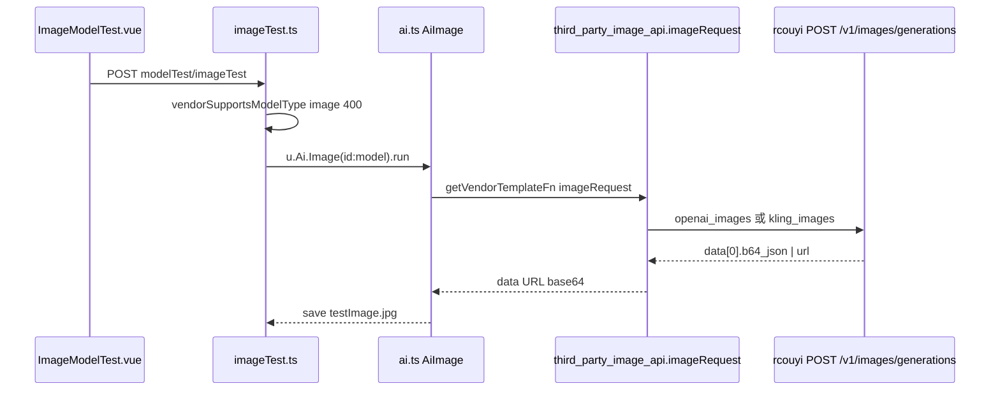
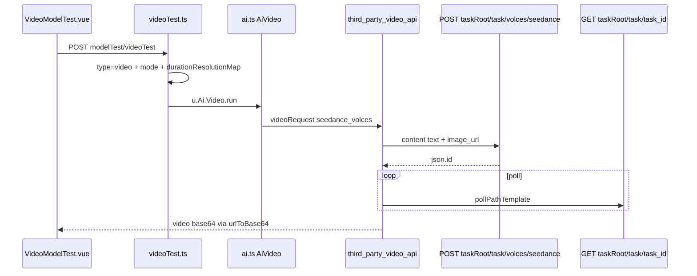
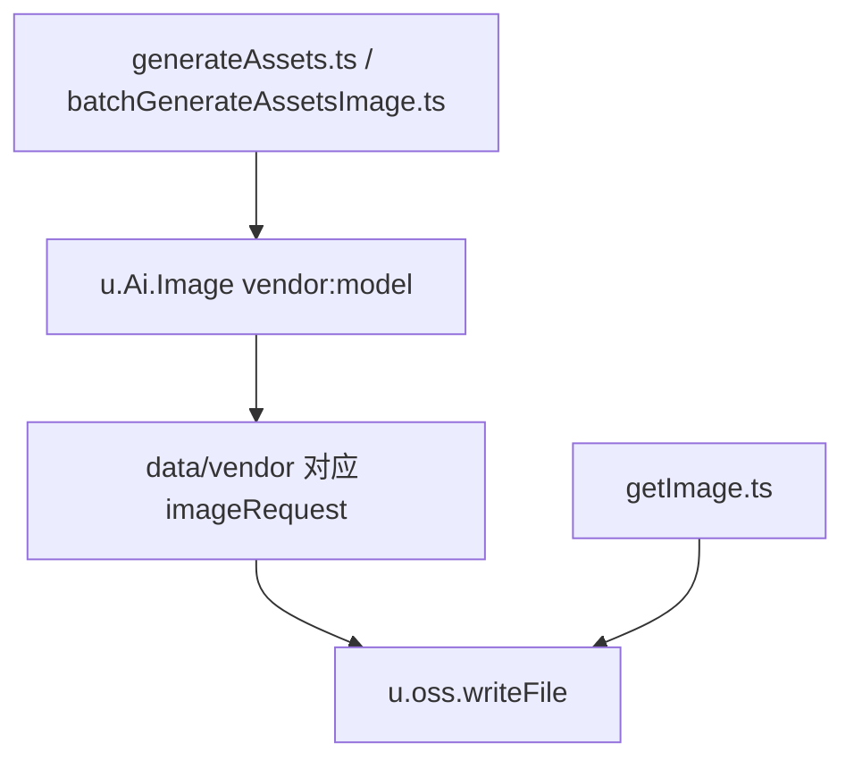
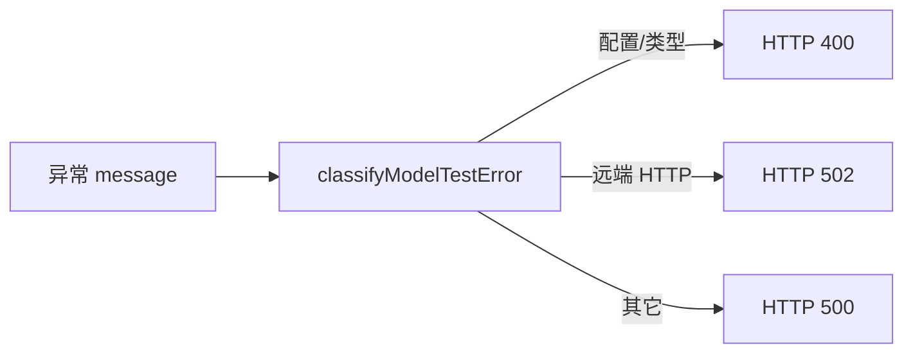

# 图像/视频模型全链路路线图

> P0-MEDIA-ROUTE-SCAN · 只读结论 · 2026-05-20  
> 配套：`MEDIA_MODEL_SCAN_FILE_LIST.md`、`VIDEO_PROVIDER_TEST_FIX_MAP.md`、`RCOUYI_MEDIA_API_ACCEPTANCE.md`

## rcouyi 双根地址（修复后约定）

| 用途 | 变量 | 示例 |
|------|------|------|
| OpenAI 图像 | `baseUrl` | `https://api.rcouyi.com/v1` |
| 任务视频/轮询 | `taskRoot` | `https://api.rcouyi.com` |

**禁止** `https://api.rcouyi.com/v1/task/...`

---

## 图 1：供应商配置链路

```mermaid
flowchart TB
  UI[vendorConfig.vue] -->|updateVendorInputs| API1[/api/setting/vendorConfig/updateVendorInputs]
  UI -->|fetchRemoteModels| API2[/api/setting/vendorConfig/fetchRemoteModels]
  UI -->|importVendorModels| API3[/api/setting/vendorConfig/importVendorModels]
  API2 --> GUESS[guessModelType.ts]
  API3 --> STORE[vendorModelStore.ts]
  STORE --> DB[(o_vendorConfig.models JSON)]
  FILE[data/vendor/*.ts 模板] --> VM[u.vendor.getCode + vm]
  DB --> LIST[getModelList vendor.ts]
  FILE --> LIST
```

关键代码：`Toonflow-app/src/utils/vendor.ts:23-35` → `getModelList()` 合并 `vendor.models`（文件）与 DB JSON。

---

## 图 2：模型列表 → 下拉

```mermaid
flowchart LR
  MS[modelSelect.vue type=image|video] --> API[/api/modelSelect/getModelList]
  API --> CAP[vendorCapabilities.filterModelsForUsage]
  CAP --> GL[getModelList]
  PD[projectDialog.vue] --> MS
  GI[generateImage.vue] --> MS
```

关键代码：`Toonflow-app/src/routes/modelSelect/getModelList.ts` + `Toonflow-app/src/utils/vendorCapabilities.ts:76-94`。

---

## 图 3：图像测试链路



关键代码：

- `Toonflow-web/src/components/setting/components/vendorTest/ImageModelTest.vue:144-157`
- `Toonflow-app/src/routes/setting/vendorConfig/modelTest/imageTest.ts`
- `Toonflow-app/src/utils/ai.ts:325-359` → `AiImage.run`
- `Toonflow-app/data/vendor/third_party_image_api.ts` → `imageRequestViaGenerations`

---

## 图 4：视频测试链路（Seedance）



关键代码：`Toonflow-app/data/vendor/third_party_video_api.ts` → `getTaskRoot()`、`videoRequestSeedance()`。

---

## 图 5：生产出图（资产）



关键代码：`Toonflow-app/src/routes/assetsGenerate/generateAssets.ts`（调用 `u.Ai.Image`）。

---

## 图 6：HTTP 状态（modelTest）



实现：`Toonflow-app/src/utils/modelTestHttp.ts`

---

## 常见 400/500 原因（本次用户报错）

| 现象 | 原因 | 处理 |
|------|------|------|
| imageTest 500 +「不支持图像」 | 在 **third_party_api** 测图，或 catch 顺序错误 | 必须用 **第三方图像 API**；已改前置 400 |
| videoTest 400 | 模型 type≠video（如 seedream 误入视频列表） | 清空误导入 + 预览导入 |
| POST /v1/task/jimeng/... 404 | task 拼到 /v1 | 设 `taskRoot` + `providerMode=seedance_volces` |

---

## 重启说明

`data/vendor/*.ts` 由 `getVendorTemplateFn` **运行时 vm 加载**，修改后需 **重启 Toonflow-app 后端**（若使用 `data/serve/app.js` 旧包亦需重新 build）。
