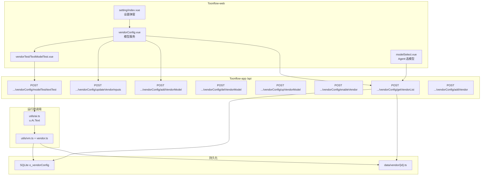

# 模型服务面板深度扫描（MODEL_SERVICE_PANEL_DEEP_MAP）

> 扫描日期：2026-05-19  
> 范围：**只读扫描**，未修改任何业务代码。  
> 目标：厘清「设置 → 模型服务」完整功能链路，并判断路径 A（第三方 API）/ 路径 B（本地模型）是否可由现有 **OpenAI标准接口**（`vendorId=openai`）覆盖。

相关文档：[MODEL_PROVIDER_MAP.md](./MODEL_PROVIDER_MAP.md)、[USE_EXISTING_OPENAI_COMPATIBLE_PROVIDER.md](./USE_EXISTING_OPENAI_COMPATIBLE_PROVIDER.md)

---

## 总览：页面入口与数据流



---

## 一、前端模型服务页面结构

### 1. 模型服务页面在哪个 Vue 文件？

| 层级 | 文件 |
|------|------|
| 设置壳 | `Toonflow-web/src/components/setting/index.vue` |
| **模型服务主体** | **`Toonflow-web/src/components/setting/components/vendorConfig.vue`**（约 1500+ 行） |
| 文本模型测试弹窗 | `Toonflow-web/src/components/setting/components/vendorTest/TextModelTest.vue` |
| 图像/视频测试 | `vendorTest/ImageModelTest.vue`、`VideoModelTest.vue` |
| 菜单文案 | `settings.menu.vendorConfig` → 中文「模型服务」 |

`stores/setting.ts` **不存** 供应商/模型数据，仅 `showSetting`、`activeMenu`（可被 `hello.vue` 设为 `vendorConfig`）、`baseUrl`（HTTP API 根路径，非模型 baseUrl）等。

### 2. 左侧供应商列表从哪里来？

- `onMounted` → `getVendorList()`
- **API**：`POST /api/setting/vendorConfig/getVendorList`
- 响应写入 `vendorList` ref；每项含 `id`、`name`（来自 `.ts` 的 `vendor.name`）、`enable`、`inputValues`、`models`、`inputs`、`code`、`description` 等
- 默认选中：`activeVendorId`，若当前 id 不在列表则选第一项

后端 `getVendorList.ts`：读 `o_vendorConfig` 全表，对每行 `u.vendor.getVendor(id)` 读 `data/vendor/{id}.ts`，合并后返回。

### 3. 「添加供应商」按钮逻辑在哪里？

- 模板底部：`handleAddVendor`（`vendorConfig.vue` 约 651 行）
- 打开 `vendorDialogVisible`，模式 `importAdd`，预填 `VENDOR_CODE_TEMPLATE`（`@/lib/vendorTemplate.ts?raw`，实质为 `null.ts` 类模板）
- 确认后 **`POST /api/setting/vendorConfig/addVendor`**，body：`{ tsCode }`
- 另有：**链接导入**（`getCodeByLink`）、**文件上传** `.ts`、**编辑供应商代码**（`updateCode`）

内置列表（initDB + `data/vendor/*.ts`）包含截图中的名称，例如：

| id | vendor.name（显示名，来自 .ts） |
|----|--------------------------------|
| toonflow | Toonflow官方中转平台 |
| deepseek | DeepSeek |
| atlascloud | AtlasCloud MASS |
| volcengine | 火山引擎 |
| minimax | MiniMax |
| **openai** | **OpenAI标准接口** |
| klingai | 可灵AI |
| vidu | Vidu 开放平台 |
| grsai | （扩展模板） |
| null | 空模板（开发用） |

### 4. 点击供应商后，右侧如何渲染？

- `t-menu` 绑定 `activeVendorId`
- `currentVendor = computed(() => vendorList.find(v => v.id === activeVendorId))`
- 右侧 `v-if="currentVendor"` 渲染：
  - `vendor.description`（MdPreview）
  - **动态表单**：`v-for="input in requiredInputs"` + 可选 `optionalInputs`（来自 `currentVendor.inputs`，定义在 `.ts` 非 DB）
  - **模型卡片**：`v-for="item in vendorModels"`

### 5. baseUrl 绑定字段

- **UI**：`currentVendor.inputValues[input.key]`，当 `input.key === "baseUrl"` 时对应「请求地址」
- **定义**：各 `data/vendor/{id}.ts` 的 `vendor.inputs` + `vendor.inputValues.baseUrl` 默认值
- **openai**：`inputValues.baseUrl`，默认 `https://api.openai.com/v1`

### 6. apiKey 绑定字段

- **UI**：`currentVendor.inputValues.apiKey`，`type="password"`
- **openai**：`inputs` 中 `key: "apiKey"`, `required: true`
- **持久化**：`o_vendorConfig.inputValues` JSON 字符串

### 7. 「手动添加模型」逻辑

- 按钮：`handleAddModel`（约 854 行）→ 打开 `modelDialogVisible`，`resetModelForm("text")`
- 确认：`handleConfirmModel` → **`POST /api/setting/vendorConfig/addVendorModel`**
  - body：`{ id: currentVendor.id, model }`
  - `model` 含 `name`（显示名）、`modelName`（API 模型 ID）、`type`（text/image/video）等

### 8. 模型卡片列表来源

- `vendorModels = computed(() => currentVendor.value?.models || ...)`
- **合并逻辑在后端** `utils/vendor.ts` → `getModelList(id)`：
  1. `data/vendor/{id}.ts` 内 `vendor.models`（模板内置，如 openai 的 GPT-4o 等）
  2. `o_vendorConfig.models` JSON（用户手动添加）
  3. 以 `modelName` 去重，**同名时 DB 覆盖模板**

页面上删除「模板内置模型」：`delVendorModel` 仅删 DB 数组；若模型仅存在于 `.ts` 模板，接口返回「基本模型不允许删除」。

### 9. 测试 / 编辑 / 删除

| 操作 | 前端方法 | 后端 API |
|------|----------|----------|
| **测试** | `handleTestModel` → 按 type 打开 Text/Image/Video 测试弹窗 | 文本：`POST .../modelTest/textTest` |
| **编辑** | `handleEditModel` → 弹窗 → `upVendorModel` | `POST .../vendorConfig/upVendorModel` |
| **删除** | `handleDeleteModel` → 确认框 | `POST .../vendorConfig/delVendorModel` |

文本测试请求体（`TextModelTest.vue`）：

```json
{
  "id": "<vendorId>",
  "modelName": "<modelName>",
  "messages": [{ "role": "user|assistant", "content": "..." }]
}
```

后端 `textTest.ts` 调用 `u.Ai.Text(\`${id}:${modelName}\`).invoke({ messages, tools: { getWeatherTool } })`（**带 tools 探测**）。

### 10. 保存配置 API

| 场景 | 方式 | API |
|------|------|-----|
| baseUrl / apiKey 失焦 | `onBlurFn` | `POST .../updateVendorInputs` |
| 输入变化防抖 | `watch(currentVendorSnapshot)` → `handleAutoUpdateVendor`（700ms） | 同上 |
| 手动保存（若存在） | 同 `updateVendorInputs` | `{ id, inputValues }` |

**不保存** `models` 到 `updateVendorInputs`；模型增删改走独立接口。

### 11. 测试模型 API

- 文本：`POST /api/setting/vendorConfig/modelTest/textTest`
- 图像/视频：`modelTest/imageTest`、`modelTest/videoTest`（路径由 `modelTest.ts` 路由目录生成）

### 12. 前端是否已有「本地模型」概念？

**无。** 无 `localModel`、`ollama`、`localhost` 等专用类型、菜单或 store 字段。仅通用 `baseUrl` 输入框（可填本地 URL）。

### 13. 前端是否已有「OpenAI-Compatible」概念？

**无独立类型名。** 仅有供应商显示名 **「OpenAI标准接口」**（id=`openai`）。  
文案提示：`vendorConfig.vue` 链接导入失败时提示「如需使用中转站请修改 **OpenAI标准接口** 的 baseUrl」。

---

## 二、后端供应商配置结构

### 1. 保存在哪张表？

**`o_vendorConfig`**（SQLite，路径见 `getPath` → `data/db2.sqlite`）

### 2. 字段结构

```text
id           TEXT  PK   -- 与 data/vendor/{id}.ts 文件名一致，不可含 ":"
inputValues  TEXT       -- JSON，如 {"apiKey":"...","baseUrl":"https://..."}
models       TEXT       -- JSON 数组，用户手动添加的模型
enable       INTEGER    -- 0 禁用 / 1 启用
```

历史列 `name`/`inputs`/`author` 等已由 `fixDB.ts` **删除**；元数据仅在 `.ts` 的 `vendor` 对象中。

### 3. apiKey 存在哪？

`JSON.parse(inputValues).apiKey` → 明文本地库。

### 4. baseUrl 存在哪？

`JSON.parse(inputValues).baseUrl`

### 5. 模型列表存在哪？

- **用户追加**：`o_vendorConfig.models`（JSON 数组）
- **模板默认**：`data/vendor/{id}.ts` → `vendor.models`
- **运行时合并**：`getModelList(id)`

### 6. 添加模型写入哪？

`addVendorModel.ts`：`models` 字段 `JSON.parse` 后 `push(model)` 再 `update`。

### 7. 删除模型删哪？

`delVendorModel.ts`：仅从 `o_vendorConfig.models` JSON 数组过滤；**不修改** `.ts` 文件内内置 models。

### 8. 启用/禁用

`enableVendor.ts`：`update({ enable })`，`0/1`。  
`modelSelect/getModelList` 仅返回 `enable=1` 的供应商。

### 9. 是否支持多个同类型供应商？

**支持多个不同 `id` 的供应商**（每个一条 `o_vendorConfig` + 一个 `{id}.ts`）。  
例如可同时启用 `deepseek` 与 `openai`，但 **不能** 有两个 `id=openai`。

同类型「多个 OpenAI 兼容实例」需：
- **方案 1**：多次 `addVendor` 导入不同 id 的 TS（如 `my_api_1`、`my_local`），代码可复用 openai 模板；
- **方案 2**：仅用一个 `openai`，靠切换 baseUrl（同时只能指向一个地址）。

### 10. 是否只能按 vendorId 固定一个供应商？

Agent 侧每条配置 **一个** `modelName` = `{vendorId}:{modelName}`。  
同一 `openai` 供应商下可挂多个 `modelName`（手动添加），但 **共用一个 baseUrl/apiKey**。

---

## 三、data/vendor 适配器机制

### 1. 现有供应商文件（`data/vendor/*.ts`）

| 文件 | id |
|------|-----|
| toonflow.ts | toonflow |
| deepseek.ts | deepseek |
| atlascloud.ts | atlascloud |
| volcengine.ts | volcengine |
| minimax.ts | minimax |
| **openai.ts** | **openai** |
| klingai.ts | klingai |
| vidu.ts | vidu |
| grsai.ts | grsai |
| null.ts | null（空模板） |

打包快照：`Toonflow-app/src/lib/vendor.json`（由 `scripts/vendor2json.ts` 生成）；`fixDB.ts` 启动时同步/升级模板到 `data/vendor/`。

### 2. openai.ts 结构（摘要）

- `vendor.inputs`：`apiKey`（password, required）、`baseUrl`（url, required）
- `vendor.models`：若干内置 text 模型（GPT-4o 等）
- `textRequest`：

```typescript
if (!vendor.inputValues.apiKey) throw new Error("缺少API Key");
return createOpenAI({ baseURL: vendor.inputValues.baseUrl, apiKey }).chat(model.modelName);
```

- `imageRequest` / `videoRequest`：空实现（返回 `""`）

### 3. OpenAI标准接口 已支持能力

| 能力 | 支持情况 |
|------|----------|
| baseUrl | ✅ `inputValues.baseUrl` → `createOpenAI({ baseURL })` |
| apiKey | ✅ 必填（见下「空 key」） |
| modelName | ✅ 手动 `addVendorModel` + 模板 models |
| stream | ✅ Agent 经 `ai.ts` `streamText`；**设置页测试为 invoke 非流式** |
| tools / function calling | ✅ `ai.ts` + `textTest` 带示例 tool；取决于第三方是否实现 |

### 4. baseUrl 填本地地址能否用于本地模型？

**可以**，只要本地服务提供 **OpenAI Chat Completions 兼容** API（Ollama、LM Studio、vLLM、LocalAI 等常见兼容）。

### 5. apiKey 为空是否允许？

**运行时：不允许。** `openai.ts` 第 140 行：`if (!vendor.inputValues.apiKey) throw new Error("缺少API Key")`。

**前端：** `apiKey` 标记 `required: true`，但输入框仍可清空；保存不会在后端路由层拦截空字符串。

### 6. 本地常要求 apiKey=ollama 或空，当前会否阻止？

| 场景 | 结果 |
|------|------|
| apiKey 留空 | ❌ `textRequest` 抛「缺少API Key」 |
| apiKey 填 `ollama` | ✅ 多数本地网关接受任意非空字符串 |
| apiKey 填 `sk-local` 等占位 | ✅ 可行 |

**最小改代码点（若将来要支持空 key）**：仅改 `data/vendor/openai.ts` 的 `textRequest` 校验（去掉或放宽 `!apiKey`），**不必改 ai.ts**。

### 7. vendor 如何被加载？

1. `getVendorList` / `getVendorTemplateFn` → `u.vendor.getCode(id)` 读 `data/vendor/{id}.ts`
2. `sucrase` 转译 TS → `u.vm(jsCode)`（`utils/vm.ts` 沙盒）
3. 注入 `createOpenAI`、`createOpenAICompatible` 等工厂
4. `Object.assign(running.vendor.inputValues, JSON.parse(o_vendorConfig.inputValues))` 覆盖 DB 中的 key/url

### 8. 新增 vendor 文件要改哪些地方？

| 步骤 | 说明 |
|------|------|
| 1 | 新增 `data/vendor/{newId}.ts`（或 `addVendor` 提交 tsCode 自动写入） |
| 2 | `o_vendorConfig` 插入一行（`addVendor` / `fixDB` `tempOnsert`） |
| 3 | 发布时运行 `node scripts/vendor2json.ts` 更新 **`src/lib/vendor.json`**（供 fixDB 升级） |
| 4 | **不必**改 `ai.ts` |

### 9. 是否需要更新 vendor.json？

- **新内置官方供应商、要随版本升级模板**：需要 regenerate `vendor.json`
- **用户自定义 addVendor**：只写 `data/vendor/{id}.ts`，**不必须**改 vendor.json

### 10. 是否需要改 initDB？

- **仅新装库**：可在 `initDB` `o_vendorConfig` 种子加一行（可选）
- **已存在库**：`fixDB` 的 `defList` 循环会对 vendor.json 有而 DB 无的 id 执行 `tempOnsert`
- **路径 A/B 用现有 openai**：**不需要**改 initDB（openai 已在种子中）

---

## 四、Agent 如何使用模型

### 1. productionAgent 模型从哪读？

1. `o_setting.agentUseMode`：`0` 简易（`productionAgent` 一条）/ `1` 高级（`productionAgent:decisionAgent` 等子 key）
2. `o_agentDeploy` 表：`key` → `modelName`（如 `openai:deepseek-chat`）
3. `ai.ts` → `resolveModelName("productionAgent:...")` → `getVendorTemplateFn("textRequest", modelName)`

配置入口：**设置 → Agent 配置**（`agentConfog.vue`）+ `modelSelect.vue`。

### 2. scriptAgent

同链路，`resolveModelName("scriptAgent" | "scriptAgent:...")`。

### 3. modelName 格式

**是**：`{vendorId}:{modelName}`，分割正则 `split(/:(.+)/)`（vendorId 不可含 `:`）。

### 4. `openai:deepseek-chat` 如何找到 openai.ts？

1. `id=openai` → `o_vendorConfig` 取 `inputValues`
2. `getCode("openai")` → `data/vendor/openai.ts`
3. `getModelList` 中查找 `modelName === "deepseek-chat"`
4. `textRequest(selectedModel, ...)` → `createOpenAI({ baseURL, apiKey }).chat("deepseek-chat")`

### 5. u.Ai.Text 调用 vendor

```text
AiText.invoke/stream
  → resolveModelName
  → getVendorTemplateFn("textRequest", "openai:xxx")
  → vm( vendor ts ) + 注入 inputValues
  → exports.textRequest(...) 返回 LanguageModel
  → generateText / streamText (Vercel AI SDK)
```

### 6. 普通文本 / stream / tools 是否同链？

**是**，同一 `getVendorTemplateFn` + 同一 model 实例；`invoke` vs `stream` 仅在 `ai.ts` 层区分。

### 7. 第三方不支持 tools 时在哪报错？

- `textTest` / Agent 决策层传入 `tools` 时，由 **AI SDK / 远端 API** 返回错误
- 常见表现：HTTP 4xx、message 含 `tools`/`function` 不支持
- **无**统一降级逻辑

### 8. 测试通过但 Agent 失败排查哪？

| 检查项 | 说明 |
|--------|------|
| Agent 是否同一 `modelName` | 测试用 `openai:xxx`，Agent 可能仍指向 `toonflow:...` |
| 供应商是否 enable | 未启用时 modelSelect 不列出，但旧配置可能残留 |
| tools | 测试也带 `getWeatherTool`；若测试过说明 tools 可能 OK，再查 Agent 消息长度/多步 |
| 简易/高级模式 | 高级子 Agent 是否单独配置模型 |
| baseUrl/apiKey 是否已保存 | 自动保存失败时 Agent 用旧 inputValues |
| SQLite | `ERR_DLOPEN_FAILED` 时配置读不到 |

---

## 五、路径 A / 路径 B 判断

### 路径 A：第三方 OpenAI-Compatible API

| 问题 | 结论 |
|------|------|
| 能否直接用现有 OpenAI标准接口？ | **能** |
| 需填字段 | 启用 `openai`；`baseUrl`（如 `https://api.deepseek.com/v1`）；`apiKey`；手动添加 `modelName`（如 `deepseek-chat`）；Agent 选 `openai:deepseek-chat` |
| 是否新增供应商？ | **不需要** |
| 是否改代码？ | **不需要**（零代码） |

### 路径 B：本地 OpenAI-Compatible 服务

| 问题 | 结论 |
|------|------|
| 能否直接用现有 OpenAI标准接口？ | **能**（协议兼容前提下） |
| 需填字段 | `baseUrl` 如 `http://localhost:11434/v1`、`http://127.0.0.1:1234/v1`、`http://localhost:8000/v1`；**`apiKey` 需填非空占位**（如 `ollama`、`local`），因 `openai.ts` 拒绝空 key |
| apiKey 能否为空？ | **当前不能**；最小改动仅 `openai.ts` 一行校验 |
| 是否需本地专用入口？ | **非必须**；专用入口仅为 UX（方案 B） |
| 是否新增供应商？ | **不需要** |
| 是否改代码？ | **零代码可试**；要空 key 才需极小改 `openai.ts` |

---

## 六、三种二开方案

### 方案 A：零代码（推荐优先）

- 继续 **OpenAI标准接口**（`openai`）
- 路径 A：云厂商 baseUrl + apiKey + modelName
- 路径 B：本地 baseUrl + **占位 apiKey** + modelName（如 `llama3`）
- 只维护操作文档：[USE_EXISTING_OPENAI_COMPATIBLE_PROVIDER.md](./USE_EXISTING_OPENAI_COMPATIBLE_PROVIDER.md)

**优点**：零风险、不改 ai/Agent/DB。  
**缺点**：UI 不区分「云端 / 本地」；多个不同 baseUrl 实例不能并行（只有一个 `openai` id）。

### 方案 B：轻 UI（推荐产品化）

- **不改** `ai.ts`、**不新增** vendor 类型、**不改** DB 表结构
- 在 `vendorConfig.vue` 增加两个引导按钮，例如：
  - 「配置第三方 API」→ 选中 `openai`，预填示例 baseUrl（用户自备地址）、聚焦 apiKey、提示添加 modelName
  - 「配置本地模型」→ 选中 `openai`，预填 `http://localhost:11434/v1`、apiKey 占位 `ollama`、提示 modelName
- 本质仍编辑 **同一个** `openai` 供应商

**优点**：满足「页面上区分两类路径」；不动后端。  
**缺点**：仍只有一个 `openai` 配置槽；切换云/本地需改 baseUrl。

### 方案 C：独立供应商（不推荐首选）

- 新增 `third_party_openai.ts`、`local_openai.ts`（复制 openai 逻辑，改 `id`/`name`）
- 更新 `vendor.json` + `fixDB` 种子
- 用户可同时保留 `openai` + `local_openai` 两套 baseUrl/apiKey

**优点**：两套配置并存、Agent 可分别绑定 `local_openai:llama3` 与 `openai:gpt-4o`。  
**缺点**：模板重复、升级要同步多文件、initDB/fixDB 迁移、列表变长；**风险高于 B**。

---

## 七、最终建议

结合你的偏好（不破坏逻辑、不改 ai/Agent、不迁移 DB、界面最好能区分云/本地、底层复用 openai）：

**推荐：先完整走方案 A 验证；确认要在 UI 上区分后再做方案 B。**

不建议现阶段上方案 C，除非你必须 **同时** 保留云 API 与本地 API 两套凭证而无需改 baseUrl。

**本地 apiKey 占位** 用 `ollama` 或任意字符串即可，无需为方案 A 改代码。

---

## 八、若采用方案 B：最小修改清单

| 类别 | 文件 | 改动 |
|------|------|------|
| 前端 Vue | `Toonflow-web/src/components/setting/components/vendorConfig.vue` | 增加两个引导按钮 + 帮助文案；`activeVendorId='openai'`；预填 `inputValues`（仅前端 state，保存仍走现有 `updateVendorInputs`） |
| i18n（可选） | `Toonflow-web/src/locales/language/zh-CN.json` 等 | 按钮/说明文案 |
| store | **不需要** | `setting.ts` 无供应商状态 |
| 后端 | **不需要** | |
| vendor.json | **不需要** | |
| data/vendor/openai.ts | **不需要** | |
| initDB | **不需要** | |
| 文档（可选） | `docs-dev/` 操作说明补充两按钮截图流程 | |

**验证**：`corepack yarn dev` → 设置 → 模型服务 → 点引导按钮 → 保存 → 文本测试 → Agent 配置 `openai:模型名`。

**回滚**：还原 `vendorConfig.vue`（及 i18n）即可。

---

## 附录：模型服务相关 API 一览

| 方法 | 路由文件 | 作用 |
|------|----------|------|
| POST | `vendorConfig/getVendorList` | 列表 + 合并 models/inputs |
| POST | `vendorConfig/updateVendorInputs` | 保存 apiKey、baseUrl 等 |
| POST | `vendorConfig/enableVendor` | 启用开关 |
| POST | `vendorConfig/addVendorModel` | 手动添加模型 |
| POST | `vendorConfig/upVendorModel` | 编辑模型 |
| POST | `vendorConfig/delVendorModel` | 删除用户添加的模型 |
| POST | `vendorConfig/modelTest/textTest` | 文本测试（含 tools） |
| POST | `vendorConfig/addVendor` | 导入新供应商 TS |
| POST | `vendorConfig/updateCode` | 更新供应商 TS |
| POST | `vendorConfig/deleteVendor` | 删除供应商行 + 删 `.ts` |
| POST | `modelSelect/getModelList` | Agent 下拉（仅 enable=1） |
| POST | `agentDeploy/deployAgentModel` | 保存 Agent 模型映射 |

---

**扫描完成。本轮仅新增本文档，未修改任何业务代码。**
