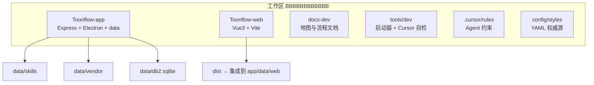
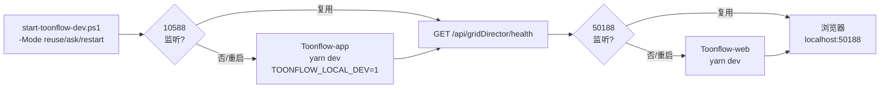
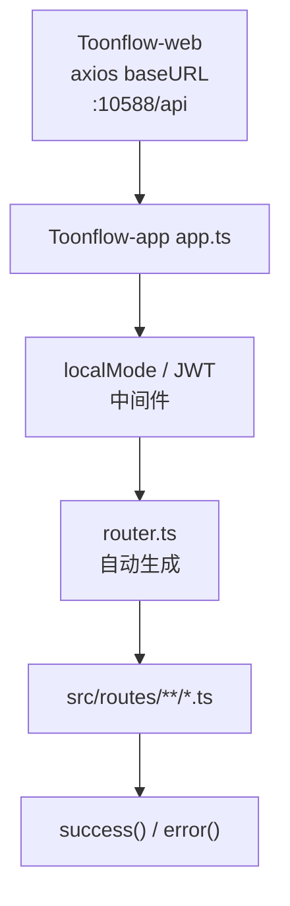
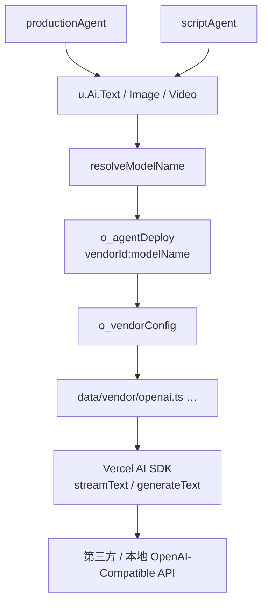
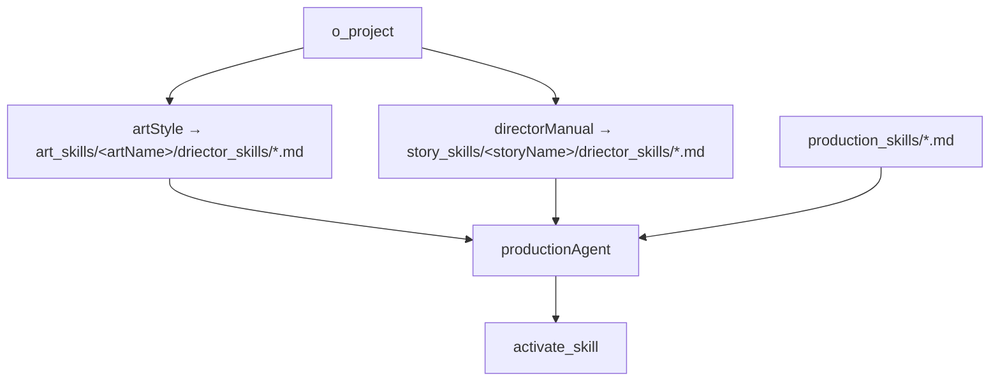
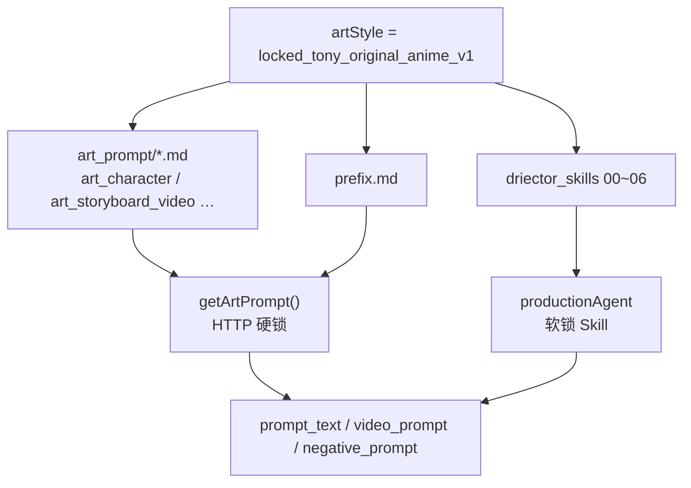
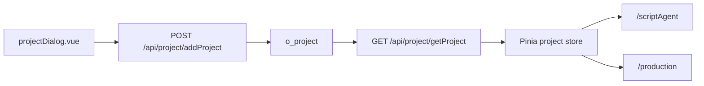
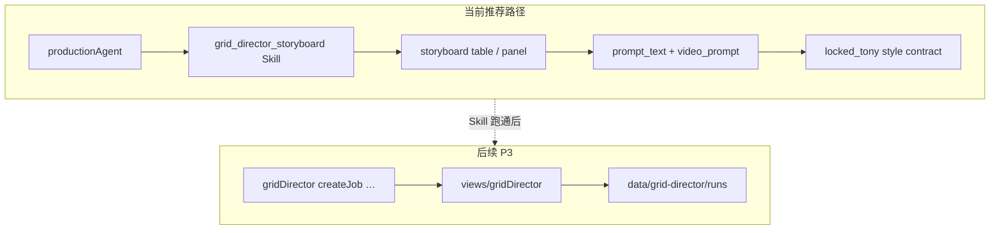

# Toonflow 全局架构总图

> 只读扫描生成 · Mermaid 可在支持 Mermaid 的编辑器中预览

---

## 1. 仓库结构图

---

## 2. 本地启动与端口图

---

## 3. HTTP API 路由图

---

## 4. Agent 模型调用图

---

## 5. Skill 加载图

> 目录名 `driector_skills` 为代码固定错拼，勿改名。

---

## 6. 高定模板图

---

## 7. 项目创建图

---

## 8. 宫格分镜当前路线图

---

## 相关文档

- 扫描详情：`PROJECT_GLOBAL_SCAN_REPORT.md`
- 任务索引：`PROJECT_NEXT_ACTION_INDEX.md`
