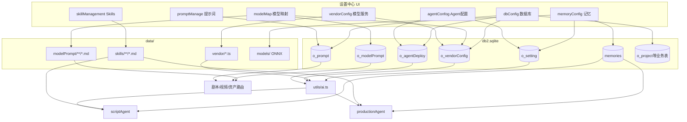

# Toonflow 设置中心模块深度扫描

> **扫描性质**：只读；未修改 `Toonflow-app` / `Toonflow-web` / `package.json` / `yarn.lock`。  
> **扫描日期**：2026-05-19（本轮按 Cursor 发单指令补全首尾）  
> **范围**：设置总入口 + 全部 10 个核心模块（重点前 7 项 + 文件管理 / 请求地址 / 开发者选项）。  

### 相关文档（同批次扫描产物）

| 文档 | 用途 |
|------|------|
| [MODEL_SERVICE_PANEL_DEEP_MAP.md](./MODEL_SERVICE_PANEL_DEEP_MAP.md) | 模型服务页专深 |
| [MODEL_PROVIDER_MAP.md](./MODEL_PROVIDER_MAP.md) | 供应商与 ai 调用链 |
| [USE_EXISTING_OPENAI_COMPATIBLE_PROVIDER.md](./USE_EXISTING_OPENAI_COMPATIBLE_PROVIDER.md) | openai 兼容零代码配置 |
| [SKILL_MD_LOADING_MAP.md](./SKILL_MD_LOADING_MAP.md) | Skill md 加载与 activate_skill |
| [TOONFLOW_PROJECT_MAP.md](./TOONFLOW_PROJECT_MAP.md) | 双仓库结构 |
| [TOONFLOW_SECONDARY_DEV_PLAN.md](./TOONFLOW_SECONDARY_DEV_PLAN.md) | 宫格二开阶段规划 |
| [LOCAL_DEV_NO_AUTH_MODE.md](./LOCAL_DEV_NO_AUTH_MODE.md) | 本地无鉴权 |
| [AUTH_MEMBERSHIP_MAP.md](./AUTH_MEMBERSHIP_MAP.md) | 登录/会员（与设置中心独立） |

### 本文档章节与发单指令对照

| 发单部分 | 本文档章节 |
|----------|------------|
| 第一部分：设置总入口 | [一、设置中心总入口](#一设置中心总入口)（11 问） |
| 第二部分：模型服务 | [二、模块 1](#二模块-1模型服务-vendorconfig)（15 问）+ [第二部分深度问答](#第二部分模型服务模块深度问答)（17 问） |
| 第三部分：模型映射 | [三、模块 2](#三模块-2模型映射-modelmap) + [第三部分深度问答](#第三部分模型映射模块深度问答) |
| 第四～八部分 | [四～七模块](#四模块-3agent-配置-agentconfog) + [第四～八部分深度问答表](#第四部分agent-配置模块深度问答) |
| 第九部分：关系图 | [第九部分：模块关系图](#第九部分模块关系图) |
| 第十部分：扩展建议 | [第十部分：扩展建议表](#第十部分扩展建议表) |
| 第十一部分：完成报告 | [第十一部分：扫描完成报告](#第十一部分扫描完成报告) |

每个业务模块（二～十一）均按 **15 项标准清单**（前端/后端/API/存储/表/data/结构/绑定/操作函数/运行时/边界/扩展/禁改/风险/最小改动）编写。

---

## 目录

1. [设置中心总入口](#一设置中心总入口)
2. [模块 1：模型服务](#二模块-1模型服务-vendorconfig)
3. [模块 2：模型映射](#三模块-2模型映射-modelmap)
4. [模块 3：Agent 配置](#四模块-3agent-配置-agentconfog)
5. [模块 4：提示词管理](#五模块-4提示词管理-promptmanage)
6. [模块 5：Skills 技能管理](#六模块-5skills-技能管理-skillmanagement)
7. [模块 6：Agent 记忆配置](#七模块-6agent-记忆配置-memoryconfig)
8. [模块 7：数据库操作](#八模块-7数据库操作-dbconfig)
9. [模块 8：文件管理](#九模块-8文件管理-filemanagement)
10. [模块 9：请求地址](#十模块-9请求地址-requestconfig)
11. [模块 10：开发者选项](#十一模块-10开发者选项-devconfig)
12. [跨模块对照表](#十二跨模块对照表)
13. [第四～八部分：深度问答索引](#第四部分agent-配置模块深度问答)
14. [第九部分：模块关系图](#第九部分模块关系图)
15. [第十部分：扩展建议表](#第十部分扩展建议表)
16. [第十一部分：扫描完成报告](#第十一部分扫描完成报告)
17. [附录：setting API 路由总表](#附录-csetting-api-路由总表)

---

## 一、设置中心总入口

> **对应发单「第一部分」11 问。**

| # | 问题 | 答案 |
|---|------|------|
| 1 | 设置弹窗 / 页面入口？ | `components/setting/index.vue`（`t-dialog` + `showSetting`）；挂载于 `pages/workbench/index.vue` 的 `<setting />` |
| 2 | 左侧菜单在哪定义？ | 同文件 `menuItems` 数组（约第 60 行） |
| 3 | menu key → 组件？ | 见下表 [1.2](#12-左侧菜单定义与-key--组件) |
| 4 | 当前有哪些模块？ | 共 16 项：ui、language、vendorConfig、modelMap、agentConfog、promptManage、skillManagement、memoryConfig、loginConfig、dbConfig、fileManagement、otherConfig、requestConfig、devConfig、about、logoutConfig |
| 5 | 新增模块改哪些文件？ | `index.vue`（import + menuItems + v-if）+ 新 `components/*.vue` + 可选 `routes/setting/*` + i18n |
| 6 | 是否懒加载？ | 构建时**静态 import**；运行时 **`v-if` 按菜单挂载**（切换销毁子组件） |
| 7 | 是否走路由？ | **否**（无 `/setting` 路由） |
| 8 | 是否用 Pinia？ | **是**：`stores/setting.ts`（`showSetting`、`activeMenu`、`baseUrl` 等） |
| 9 | localStorage？ | Pinia persist：`baseUrl`、`otherSetting`、`themeSetting`、`language` |
| 10 | 后端 DB？ | 各子页各自写入（见二～十一）；设置壳本身不写 DB |
| 11 | 仅前端状态？ | `showSetting`、弹窗草稿、未 persist 的表单中间态 |

### 1.1 入口与挂载

| 问题 | 结论 |
|------|------|
| 设置弹窗 / 页面入口 | `Toonflow-web/src/components/setting/index.vue`：`t-dialog` + `v-model:visible="showSetting"` |
| 全局挂载位置 | `Toonflow-web/src/pages/workbench/index.vue` 底部 `<setting />` |
| 打开方式 | `settingStore().showSetting = true`；工作台侧栏齿轮、`hello.vue` 引导可设 `activeMenu` 后打开 |
| 与路由 | **无独立路由**；纯 Dialog + Pinia，不经过 `vue-router` |
| 与 Pinia | **强相关**：`Toonflow-web/src/stores/setting.ts` 管理 `showSetting`、`activeMenu`、`baseUrl` 等 |

### 1.2 左侧菜单定义与 key → 组件

定义在 `index.vue` 的 `menuItems` 数组，通过 `v-if="activeMenu === 'xxx'"` 切换右侧内容：

| menu key | i18n label key | 组件文件 |
|----------|----------------|----------|
| `ui` | `settings.menu.ui` | `components/uiConfig.vue` |
| `language` | `settings.menu.language` | `components/languageConfig.vue` |
| `vendorConfig` | `settings.menu.vendorConfig` | `components/vendorConfig.vue` |
| `modelMap` | `settings.menu.modelMap` | `components/modelMap.vue` |
| `agentConfog` | `settings.menu.agentConfig` | `components/agentConfog.vue`（文件名拼写为 Confog） |
| `promptManage` | `settings.menu.promptManage` | `components/promptManage.vue` |
| `skillManagement` | `settings.menu.skillsSkillsManagement` | `components/skillManagement.vue` |
| `memoryConfig` | `settings.menu.memoryConfig` | `components/memoryConfig.vue` |
| `loginConfig` | `settings.menu.loginConfig` | `components/loginConfig.vue` |
| `dbConfig` | `settings.menu.dbConfig` | `components/dbConfig.vue` |
| `fileManagement` | `settings.menu.fileManagement` | `components/fileManagement.vue` |
| `otherConfig` | `settings.menu.otherConfig` | `components/otherConfig.vue` |
| `requestConfig` | `settings.menu.requestConfig` | `components/requestConfig.vue` |
| `devConfig` | `settings.menu.devConfig` | `components/devConfig.vue` |
| `about` | `settings.menu.about` | `components/about.vue` |
| `logoutConfig` | `settings.menu.logoutConfig` | `components/logoutConfig.vue` |

### 1.3 新增设置模块需改的文件（最小）

1. `Toonflow-web/src/components/setting/index.vue`：`import` 组件、`menuItems` 增项、`v-if` 分支  
2. 新组件：`Toonflow-web/src/components/setting/components/<name>.vue`  
3. 若需后端：`Toonflow-app/src/routes/setting/<module>/*.ts`（由 `core.ts` 自动注册为 `/api/setting/...`）  
4. i18n：`Toonflow-web` 语言包中 `settings.menu.*`  
5. （可选）`stores/setting.ts` 若需持久化或全局状态  

### 1.4 懒加载

- **非** `defineAsyncComponent` 路由级懒加载；所有子组件在 `index.vue` **静态 import**，打包时一并打入 chunk。  
- **有** 菜单级「按需挂载」：`v-if` 仅在 `activeMenu` 匹配时创建 DOM，切换菜单会销毁/重建子组件。  
- 结论：运行时懒挂载，构建时非 code-split。

### 1.5 存储分层：localStorage / DB / 仅前端

| 存储 | 内容 | 机制 |
|------|------|------|
| **localStorage（Pinia persist）** | `baseUrl`、`otherSetting`、`themeSetting`、`language` | `stores/setting.ts` → `persist: { pick: [...] }` |
| **SQLite** | 模型、Agent、业务 Prompt、记忆参数、记忆数据、模型-Prompt 绑定等 | 见各模块 |
| **`data/` 文件** | vendor 脚本、skills md、modelPrompt md、ONNX 模型等 | 见各模块 |
| **仅组件内 ref** | 各设置页表单草稿、弹窗状态 | 未 persist，关弹窗可能丢失未保存编辑 |

登录页另有独立小弹窗改 `baseUrl`（`pages/login/index.vue`），与设置中心 `requestConfig` 共用同一 store 字段。

---

## 二、模块 1：模型服务 (`vendorConfig`)

> 细节见 **`docs-dev/MODEL_SERVICE_PANEL_DEEP_MAP.md`**；本节为设置中心视角摘要。

### 1 前端页面

`Toonflow-web/src/components/setting/components/vendorConfig.vue`

### 2 后端接口

目录：`Toonflow-app/src/routes/setting/vendorConfig/`

| 方法路径（相对 `/api`） | 文件 | 用途 |
|-------------------------|------|------|
| `POST /setting/vendorConfig/getVendorList` | `getVendorList.ts` | 列表（DB + `data/vendor/*.ts`） |
| `POST /setting/vendorConfig/addVendor` | `addVendor.ts` | 新增供应商 |
| `POST /setting/vendorConfig/deleteVendor` | `deleteVendor.ts` | 删除 |
| `POST /setting/vendorConfig/enableVendor` | `enableVendor.ts` | 启用/禁用 |
| `POST /setting/vendorConfig/updateVendorInputs` | `updateVendorInputs.ts` | 保存 apiKey、baseUrl 等 |
| `POST /setting/vendorConfig/addVendorModel` | `addVendorModel.ts` | 手动加模型 |
| `POST /setting/vendorConfig/delVendorModel` | `delVendorModel.ts` | 删模型 |
| `POST /setting/vendorConfig/upVendorModel` | `upVendorModel.ts` | 更新模型元数据 |
| `POST /setting/vendorConfig/modelTest` | `modelTest.ts` | 测试入口 |
| `POST /setting/vendorConfig/modelTest/textTest` 等 | `modelTest/*.ts` | 分类型测试 |
| `POST /setting/vendorConfig/updateCode` | `updateCode.ts` | 更新 vendor 源码 |
| `POST /setting/vendorConfig/getCodeByLink` | `getCodeByLink.ts` | 从链接拉代码 |

### 3 调用的 API

组件内直接 `axios.post/get` 上述路径（**未**集中到 `src/services`）。

### 4 数据保存位置

- **主存**：SQLite 表 `o_vendorConfig`（`id`, `inputValues` JSON, `models` JSON, `enable`）  
- **执行逻辑**：`Toonflow-app/data/vendor/<id>.ts`（VM 加载，`u.vendor.getVendor` / `getModelList`）

### 5 SQLite 表

`o_vendorConfig`

### 6 data 目录

- `data/vendor/<vendorId>.ts` — 供应商适配器  
- 无按 job 的子目录

### 7 数据结构（核心）

```ts
// o_vendorConfig 行
{ id: string; inputValues: string; /* JSON Record */ models: string; /* JSON Model[] */ enable: 0|1 }

// Agent 侧使用的 modelName 格式（在 Agent 模块配置，非本页直接字段）
// "{vendorId}:{modelName}"
```

`models` 内单项通常含 `name`, `modelName`, `type`（text/image/video）等，以 vendor 脚本为准。

### 8 页面字段绑定

- 列表：`vendorList` ← `getVendorList`  
- 表单：`inputValues` 动态字段 ← vendor 元数据 `input` 定义  
- 开关：`enable` ↔ `enableVendor`  
- 模型表：嵌套在供应商卡片内，操作调 add/del/up API

### 9 保存 / 新增 / 删除 / 测试

| 操作 | 前端函数（典型） | 后端 |
|------|------------------|------|
| 保存连接参数 | `saveVendorInputs` / 类似 | `updateVendorInputs` |
| 新增供应商 | 弹窗确认 | `addVendor` |
| 删除供应商 | 确认后 | `deleteVendor` |
| 启用禁用 | switch change | `enableVendor` |
| 模型增删改 | 表格按钮 | `addVendorModel` / `delVendorModel` / `upVendorModel` |
| 测试 | `modelTest` 分支 | `modelTest/*Test` |

### 10 运行时使用方

- `Toonflow-app/src/utils/ai.ts` → `getVendorTemplateFn`  
- 所有 `u.Ai.Text/Image/Video` 调用链  
- `scriptAgent` / `productionAgent` 及路由层直接 `u.Ai.*` 的业务接口  
- Agent 配置页拉同一 `getVendorList` 做模型下拉

### 11 功能边界

- 只管理**供应商连接与模型清单**，不绑定「哪个 Agent 用哪个模型」（属 Agent 配置）。  
- 新增供应商类型需有 `data/vendor/<id>.ts` 或走「自定义代码」路径。  
- 本地开发 apiKey 校验以 vendor 脚本为准（如 `openai.ts` 非空检查）。

### 12 推荐扩展点

- 新供应商：**新增** `data/vendor/<id>.ts` + DB 行，或 UI「自定义 vendor」  
- 仅 UI 文案/分组：改 `vendorConfig.vue` + i18n  
- 新模型类型测试：在 `modelTest/` 加子路由

### 13 不推荐改

- `src/utils/ai.ts` 核心路由（除非统一改调用契约）  
- `core.ts` 路由扫描机制  
- 已有 vendor 的 `generateText` 签名（影响面过大）

### 14 风险点

- VM 执行 vendor 代码 → **供应链/注入**风险  
- `models` / `inputValues` 为 JSON 字符串，损坏会导致整站 AI 不可用  
- 删除正在使用的 vendor 会导致 Agent `modelName` 悬空

### 15 最小可改文件清单

| 场景 | 文件 |
|------|------|
| 新 OpenAI 兼容供应商 | `data/vendor/<id>.ts`，可选 `vendorConfig.vue` 展示名 |
| 新 API | `routes/setting/vendorConfig/<action>.ts` |
| 列表展示 | `vendorConfig.vue` |

---

## 三、模块 2：模型映射 (`modelMap`)

### 1 前端页面

`Toonflow-web/src/components/setting/components/modelMap.vue`

### 2 后端接口

`Toonflow-app/src/routes/setting/modelMap/`

| API | 文件 |
|-----|------|
| `POST /setting/modelMap/getImageAndVideoModel` | `getImageAndVideoModel.ts` |
| `GET /setting/modelMap/getPromptList` | `getPromptList.ts` |
| `POST /setting/modelMap/savePrompt` | `savePrompt.ts` |
| `POST /setting/modelMap/updatePrompt` | `updatePrompt.ts` |
| `POST /setting/modelMap/deletePrompt` | `deletePrompt.ts` |
| `POST /setting/modelMap/bindingPrompt` | `bindingPrompt.ts` |

### 3 调用的 API

`onMounted` → `queryModelMap`；弹窗内 `getPromptList`、`onConfirm` → `bindingPrompt`；提示词库 `savePrompt` / `updatePrompt` / `deletePrompt`。

### 4 数据保存位置

- **绑定关系**：`o_modelPrompt`（`vendorId`, `model`, `fileName`, `path`）  
- **Prompt 正文**：`data/modelPrompt/<image|video>/<name>.md` 文件

### 5 SQLite 表

`o_modelPrompt`（`id`, `vendorId`, `model`, `fileName`, `path`）

### 6 data 目录

`Toonflow-app/data/modelPrompt/image/*.md`  
`Toonflow-app/data/modelPrompt/video/*.md`

### 7 数据结构

```ts
// 列表项（getImageAndVideoModel 返回）
{ id: vendorId; name: vendorName; promptList: Array<{
  name, type: "video", model: modelName,
  fileName?, path?  // 已绑定时有
}>}

// 绑定请求
{ vendorId, model, path, fileName }

// Prompt 文件列表项（getPromptList）
{ name, type: "image"|"video", path, data: string }
```

**注意**：`getImageAndVideoModel` 当前实现**只筛选 `type === "video"`** 的模型，名称中的 Image 未在列表暴露。

### 8 页面字段绑定

- 主表：`modelMap` ← `getImageAndVideoModel`  
- 绑定弹窗：`promptForm`（`model`, `fileName`, `path`）← 行点击 `promptEditor`  
- 提示词库：`promptList`、`editingPrompt`（name/type/data）

### 9 保存 / 新增 / 删除 / 测试

| 操作 | 前端函数 | 后端 |
|------|----------|------|
| 刷新列表 | `queryModelMap` | `getImageAndVideoModel` |
| 绑定 | `onConfirm` | `bindingPrompt` |
| 取消绑定 | `unselectPrompt` + `onConfirm`（空 fileName） | `bindingPrompt` |
| 新建 md | `onAddPromptConfirm`（!isEdit） | `savePrompt` |
| 编辑 md | `onAddPromptConfirm`（isEdit） | `updatePrompt` |
| 删除 md | `delPrompt` | `deletePrompt` |
| 测试 | **无** | — |

### 10 运行时使用方

- `routes/production/workbench/generateVideoPrompt.ts`：读 `o_modelPrompt` + 回退 `data/modelPrompt/video/*.md` + 再回退 `o_prompt.videoPromptGeneration`  
- `batchGeneratePrompt.ts`：主要用 `o_prompt`，不读 modelMap 绑定  
- 视频生成流水线中选模型后按 vendor+model 取 prompt 模板

### 11 功能边界

- 面向**视频模型**与**视频 prompt 模板**绑定，不是通用 Agent system prompt。  
- 不能在此配置 LLM 文本模型。  
- UI 可维护 md 库，但绑定粒度是 `(vendorId, model)` 一对一。

### 12 推荐扩展点

- 支持 image 模型：改 `getImageAndVideoModel.ts` 过滤条件 + `modelMap.vue` 列展示  
- 新视频模型默认 prompt：在 `modelPrompt/video/` 加 md + UI 绑定  
- 绑定逻辑：仅 `bindingPrompt.ts`

### 13 不推荐改

- `o_prompt` 中 `videoPromptGeneration` 大段种子数据（除非统一迁移策略）  
- `generateVideoPrompt` 多级回退顺序（易破坏线上生成）

### 14 风险点

- `bindingPrompt` insert 未显式传 `id`，依赖 SQLite 自增/迁移是否一致  
- 删除 md 文件后 DB 绑定仍存在 → 运行时读文件失败  
- path 需与 `getPath(["modelPrompt"])` 一致，避免手写绝对路径

### 15 最小可改文件清单

| 场景 | 文件 |
|------|------|
| 新 md 模板 | `data/modelPrompt/video/<name>.md` |
| 绑定 API | `bindingPrompt.ts` |
| 列表 UI | `modelMap.vue` |
| 消费方 | `generateVideoPrompt.ts` |

---

## 四、模块 3：Agent 配置 (`agentConfog`)

### 1 前端页面

`Toonflow-web/src/components/setting/components/agentConfog.vue`

### 2 后端接口

`Toonflow-app/src/routes/setting/agentDeploy/`

| API | 文件 |
|-----|------|
| `POST /setting/agentDeploy/getAgentDeploy` | `getAgentDeploy.ts` |
| `POST /setting/agentDeploy/deployAgentModel` | `deployAgentModel.ts` |
| `POST /setting/agentDeploy/agentSetKey` | `agentSetKey.ts` |
| `GET /setting/agentDeploy/getAgentUseMode` | `getAgentUseMode.ts` |
| `POST /setting/agentDeploy/updateUseMode` | `updateUseMode.ts` |

兼用：`POST /setting/vendorConfig/getVendorList`（模型下拉、一键填入）

### 3 调用的 API

见上；`onMounted` → `getAgentDeploy`、`getUseModeVal`；配置弹窗 `confirmConfig` → `deployAgentModel`；一键填入 `oneClickToFillIn` → `agentSetKey`。

### 4 数据保存位置

- **Agent 行**：`o_agentDeploy`  
- **简易/高级模式**：`o_setting.key = 'agentUseMode'`（值 `"0"` 简易 / `"1"` 高级）

### 5 SQLite 表

- `o_agentDeploy`（`id`, `key`, `name`, `desc`, `model`, `modelName`, `vendorId`, `temperature`, `maxOutputTokens`, `disabled`）  
- `o_setting`（`agentUseMode`）

种子 `key` 含：`scriptAgent`、`productionAgent` 等；`key` 含 `:` 的为**高级子配置**（`advancedData`）。

### 6 data 目录

无专属于本模块的文件；模型解析依赖 `data/vendor/`。

### 7 数据结构

```ts
// modelName 运行时格式（ai.ts 使用）
"{vendorId}:{modelNameInVendor}"

// getAgentDeploy 返回
{ qrdinaryData: AgentRow[]; advancedData: AgentRow[] }  // 按 key 是否含 ":" 拆分
```

### 8 页面字段绑定

- 列表：`modelData` / `advancedModelData`  
- 弹窗：`currentItem` + `selectValue`（vendorId:model）+ `temperature` + `maxOutputTokens`  
- 模式：`agentUseModeVal` ↔ `getAgentUseMode` / `updateUseMode`

### 9 保存 / 新增 / 删除 / 测试

| 操作 | 前端函数 | 后端 |
|------|----------|------|
| 保存单 Agent | `confirmConfig` | `deployAgentModel` |
| 一键 Toonflow Key | `submitAgentSetKey` | `agentSetKey` |
| 切换简易/高级 | `updateUseMode` | `updateUseMode` |
| 新增/删除 Agent 行 | **UI 无** | 仅 DB 种子/fixDB |
| 测试 | **无** | — |

### 10 运行时使用方

- **`Toonflow-app/src/utils/ai.ts`**：`resolveModelName(agentKey)` 读 `o_agentDeploy` + `agentUseMode`  
- **`scriptAgent`**、`productionAgent`：`u.Ai.Text("scriptAgent")` 等  
- **Memory 摘要**：`memory.ts` 内 `u.Ai.Text(this.agentType)`  
- 任意传入 agent key 的路由（剧本提取、视频 prompt 等）

### 11 功能边界

- 不能在此编辑 Agent **system prompt**（在 Skills / 决策 md）  
- 不能新增 agent **类型**（需改 initDB 种子 + Agent 源码注册）  
- `disabled` 字段存在但 UI 需确认是否暴露

### 12 推荐扩展点

- 新 Agent 槽位：`initDB` 插 `o_agentDeploy` 行 + 新 `agents/<name>/index.ts` + 本页自动展示  
- 新参数（如 topP）：`deployAgentModel.ts` + `agentConfog.vue` + `ai.ts` 读取  
- 高级模式子 key：插入 `key` 含 `:` 的行

### 13 不推荐改

- `ai.ts` 中 `resolveModelName` 三分支逻辑（除非全量测试所有 Agent）  
- 将 `modelName` 格式改为非 `vendorId:model`（破坏全库配置）

### 14 风险点

- 未配置 `modelName` 时任意 AI 调用抛错  
- `agentSetKey` 批量写 vendor 可能覆盖用户自建 openai 配置  
- 高级模式下子 key 缺失会导致部分工具链失败

### 15 最小可改文件清单

| 场景 | 文件 |
|------|------|
| 新 Agent 默认项 | `lib/initDB.ts`（种子） |
| 保存 API | `deployAgentModel.ts` |
| UI | `agentConfog.vue` |
| 运行时 | `utils/ai.ts`、`agents/*/index.ts` |

---

## 五、模块 4：提示词管理 (`promptManage`)

### 1 前端页面

`Toonflow-web/src/components/setting/components/promptManage.vue`

### 2 后端接口

`Toonflow-app/src/routes/setting/promptManage/`

| API | 文件 |
|-----|------|
| `POST /setting/promptManage/getPrompt` | `getPrompt.ts` |
| `POST /setting/promptManage/updatePrompt` | `updatePrompt.ts` |

### 3 调用的 API

`getPrompt` on mount；对话框确认 `updatePrompt`。

### 4 数据保存位置

SQLite `o_prompt`：**写入字段 `useData`**；`data` 列为出厂默认（种子/fixDB）。

读取逻辑：`getPrompt` 返回 `data: item.useData || item.data`。

### 5 SQLite 表

`o_prompt`（`id`, `name`, `type`, `data`, `useData`）

种子 `type` 包括：

| type | 用途 |
|------|------|
| `eventExtraction` | 小说章节事件提取 `cleanNovel.ts` |
| `scriptAssetExtraction` | 剧本资产提取 `extractAssets.ts` |
| `videoPromptGeneration` | 视频分镜 prompt 生成（Workbench） |
| `audioBindPrompt` | 音色绑定 `cornerScape/batchBindAudio.ts` |

### 6 data 目录

本模块**不**直接写文件；与 `modelMap` 的 md 库分离。

### 7 数据结构

```ts
{ id: number; name: string; type: string; data: string }  // 前端展示用合并后的 data
// 保存时 POST { id, data } → 后端写入 useData
```

### 8 页面字段绑定

- 卡片列表：`data[]` ← `getPrompt`  
- 编辑：`promptData` ↔ `MdEditor` `v-model="promptData.data"`

### 9 保存 / 新增 / 删除 / 测试

| 操作 | 前端 | 后端 |
|------|------|------|
| 保存 | `onConfirm` | `updatePrompt` → 更新 `useData` |
| 新增类型 | **无 UI** | 需手动 DB / initDB |
| 删除 | **无** | — |
| 测试 | **无** | — |

### 10 运行时使用方

- `utils/cleanNovel.ts` → `eventExtraction`  
- `routes/script/extractAssets.ts` → `scriptAssetExtraction`  
- `routes/production/workbench/generateVideoPrompt.ts`、`batchGeneratePrompt.ts` → `videoPromptGeneration`  
- `routes/cornerScape/batchBindAudio.ts` → `audioBindPrompt`  
- **不**用于 `scriptAgent` / `productionAgent` 主对话 system（那些走 Skills md）

### 11 功能边界

- 固定条目的**业务 Prompt 模板**编辑器，不是通用 Prompt CMS。  
- 无版本历史、无按项目覆盖。  
- 卡片展示截断的 `data`，完整内容在弹窗编辑。

### 12 推荐扩展点

- 新业务 Prompt：在 `initDB`/`fixDB` 加 `o_prompt` 行 + 业务代码 `where("type", "...")` + 可选 i18n 名称  
- 恢复默认：可提供「从 `data` 复制到 `useData`」按钮（需新 API）

### 13 不推荐改

- 种子 `data` 巨型 markdown（升级合并困难）  
- 与 `modelMap` 的 `videoPromptGeneration` 回退链混淆（两套来源）

### 14 风险点

- 仅更新 `useData`，删除 DB 后回退到旧默认 `data`  
- `updatePrompt` 成功响应写死 `success(123)`，前端未校验  
- 业务代码部分读 `useData` 部分读文件回退，行为不一致

### 15 最小可改文件清单

| 场景 | 文件 |
|------|------|
| 新 prompt 类型 | `initDB.ts` + 消费路由 + `promptManage.vue`（仅展示） |
| 保存 | `updatePrompt.ts` |
| 消费 | 对应 `routes/**` 或 `utils/**` |

---

## 六、模块 5：Skills 技能管理 (`skillManagement`)

### 1 前端页面

`Toonflow-web/src/components/setting/components/skillManagement.vue`

### 2 后端接口

`Toonflow-app/src/routes/setting/skillManagement/`

| API | 文件 |
|-----|------|
| `POST /setting/skillManagement/getSkillList` | `getSkillList.ts` |
| `POST /setting/skillManagement/getSkillContent` | `getSkillContent.ts` |
| `POST /setting/skillManagement/saveSkillContent` | `saveSkillContent.ts` |

### 3 调用的 API

`fetchList` → `getSkillList`；树选中 `loadContent` → `getSkillContent`；保存 `onSave` → `saveSkillContent`。

### 4 数据保存位置

**仅文件系统**：`Toonflow-app/data/skills/**/*.md`  
（`fast-glob` 相对 `u.getPath(["skills"])`）

**不**通过本 UI 写 `o_skillList` 表；该表由 initDB/其他流程维护，Agent 运行时读目录。

### 5 SQLite 表

- 本 UI：**无**  
- 相关：`o_skillList`、`o_skillAttribution`（技能索引/归属，Agent 内可能用，非本页 CRUD）

### 6 data 目录

```
data/skills/
  production_skills/*.md   ← productionAgent 加载
  art_skills/*.md
  story_skills/*.md
  ... 任意子目录 *.md
```

### 7 数据结构

```ts
// getSkillList 返回
string[]  // 如 "production_skills/grid_director_storyboard.md"

// saveSkillContent body
{ path: string; content: string }  // path 相对 skills 根，防路径穿越
```

Skill 文件格式：Markdown，常含 frontmatter `name` / `description`（Agent 解析约定）。

### 8 页面字段绑定

- 树：`entries` → `treeData` 计算属性  
- 预览：`content` ← `getSkillContent`  
- 编辑：`draft` ↔ `MdEditor`

### 9 保存 / 新增 / 删除 / 测试

| 操作 | 前端 | 后端 |
|------|------|------|
| 保存 | `onSave` | `saveSkillContent`（覆盖已有文件） |
| 新增文件 | **无 UI** | 需手动在 `data/skills` 建 md 后刷新列表 |
| 删除 | **无** | — |
| 测试 | **无** | 需在 Agent 对话中 `activate_skill` |

### 10 运行时使用方

- **`productionAgent`**：`data/skills/production_skills`  
- **`scriptAgent`** 等：对应 `story_skills` / `art_skills` 目录（见各 Agent `index.ts`）  
- 决策层通过 tool `activate_skill` 加载正文  
- **宫格导演** 等二开：往 `production_skills` 加 md 即可被扫描

### 11 功能边界

- 编辑器=**全文仓库**；无版本、无 diff、无按项目隔离。  
- 不能在此配置「哪个 Agent 有哪些 skill」（由目录划分 + Agent 代码硬编码路径）。  
- 不能新建空文件，只能改已有路径。

### 12 推荐扩展点

- 新 Skill：**新建** `data/skills/<agent_dir>/<name>.md` + 决策 prompt 提及 skill 名  
- 安全加固：保持 `is-path-inside` 校验（已在 `saveSkillContent`）  
- 可选增强：`saveSkillContent` 旁路增加「新建文件」API（需新路由）

### 13 不推荐改

- Agent 内 `activate_skill` 解析协议（除非同步改所有 md）  
- 将 skills 迁入 DB（与现有 glob 加载机制冲突）

### 14 风险点

- 直接改生产 skill 影响所有用户/项目  
- 无删除 UI，误改只能 VCS/备份恢复  
- `o_skillList` 与文件不同步时，若有代码走 DB 索引可能不一致

### 15 最小可改文件清单

| 场景 | 文件 |
|------|------|
| 新 skill | `data/skills/<subdir>/<skill>.md` |
| 编辑保存 | 已有 `saveSkillContent.ts` |
| Agent 识别 | `agents/productionAgent/index.ts` + 决策 md |

---

## 七、模块 6：Agent 记忆配置 (`memoryConfig`)

### 1 前端页面

`Toonflow-web/src/components/setting/components/memoryConfig.vue`

### 2 后端接口

`Toonflow-app/src/routes/setting/memoryConfig/`

| API | 文件 |
|-----|------|
| `GET /setting/memoryConfig/getMemory` | `getMemory.ts` |
| `POST /setting/memoryConfig/sureMemory` | `sureMemory.ts` |
| `POST /setting/memoryConfig/delAllMemory` | `delAllMemory.ts` |

### 3 调用的 API

`getMemoryConfig`；表单 `@submit` → `handleSave`；清空 `handleClearMemory`；恢复默认 `handleRestory`（前端默认值 + `handleSave`）。

### 4 数据保存位置

- **参数**：`o_setting` 多行 key-value（见下）  
- **记忆内容**：`memories` 表（向量+摘要+短期消息）  
- **向量模型文件**：`data/models/<modelOnnxFile 路径拼接>`（非 DB）

### 5 SQLite 表

| 表 | 用途 |
|----|------|
| `o_setting` | 记忆超参 + `modelOnnxFile` JSON + `modelDtype` |
| `memories` | 实际记忆条目（`isolationKey`, `type`, `content`, `embedding`, …） |

`o_setting` keys：`messagesPerSummary`, `shortTermLimit`, `summaryMaxLength`, `summaryLimit`, `ragLimit`, `deepRetrieveSummaryLimit`, `modelOnnxFile`, `modelDtype`

### 6 data 目录

`data/models/` — ONNX 嵌入模型（默认 `all-MiniLM-L6-v2/onnx/model_fp16.onnx`）

### 7 数据结构

```ts
interface MemoryConfigForm {
  messagesPerSummary: number;
  shortTermLimit: number;
  summaryMaxLength: number;
  summaryLimit: number;
  ragLimit: number;
  deepRetrieveSummaryLimit: number;
  modelOnnxFile: string[];  // 存 DB 为 JSON.stringify
  modelDtype: string;
}

// memories 行（运行时）
{ id, isolationKey, type: 'message'|'summary', role, content, embedding, ... }
```

### 8 页面字段绑定

`t-form :data="formData"`；各 `t-input-number` / `t-tag-input` / `t-select` 双向绑定 `formData.*`。

### 9 保存 / 新增 / 删除 / 测试

| 操作 | 前端 | 后端 |
|------|------|------|
| 保存配置 | `handleSave` | `sureMemory` upsert `o_setting` |
| 清空记忆 | `handleClearMemory` | `delAllMemory` → `DELETE FROM memories` |
| 恢复默认 | `handleRestory` + save | 同 sureMemory |
| 测试 | **无** | — |

### 10 运行时使用方

- **`Toonflow-app/src/utils/agent/memory.ts`**：`getConfigData` 读 `o_setting`；读写 `memories`  
- **`scriptAgent`**、**`productionAgent`**：`new Memory(agentType, isolationKey)`，注入 prompt 与 tools  
- 嵌入：`utils/agent/embedding.ts` + ONNX 路径来自配置

### 11 功能边界

- 调全局记忆策略，**不能**按项目/Agent 单独 UI 配置（隔离靠 `isolationKey` 运行时区分）。  
- 清空只删 `memories`，不重置 `o_setting` 参数。  
- 不管理对话 UI 展示，只管理 RAG/摘要行为。

### 12 推荐扩展点

- 新参数：在 `sureMemory`/`getMemory`/`memory.ts` DEFAULTS 三处对齐  
- 按 Agent 不同默认：扩展 `o_setting` key 前缀或新表（较大改动）  
- 换嵌入模型：改 `modelOnnxFile` + `data/models` 文件

### 13 不推荐改

- `memories` 表结构（无迁移工具时风险高）  
- 摘要调用链上的 agentType（绑定 `o_agentDeploy` 模型）

### 14 风险点

- `delAllMemory` **不可恢复**  
- ONNX 路径错误 → 嵌入失败，RAG 退化  
- 摘要依赖 LLM，未配 Agent 模型时摘要也会失败

### 15 最小可改文件清单

| 场景 | 文件 |
|------|------|
| 新参数 UI | `memoryConfig.vue` + `sureMemory.ts` + `getMemory.ts` + `memory.ts` |
| 清空逻辑 | `delAllMemory.ts` |
| 模型文件 | `data/models/**` |

---

## 八、模块 7：数据库操作 (`dbConfig`)

### 1 前端页面

`Toonflow-web/src/components/setting/components/dbConfig.vue`

### 2 后端接口

`Toonflow-app/src/routes/setting/dbConfig/`

| API | 文件 |
|-----|------|
| `GET /setting/dbConfig/dbInfo` | `dbInfo.ts` |
| `GET /setting/dbConfig/exportData` | `exportData.ts` |
| `POST /setting/dbConfig/importData` | `importData.ts` |
| `GET /setting/dbConfig/clearData` | `clearData.ts` |
| `POST /setting/dbConfig/clearTable` | `clearTable.ts` |

### 3 调用的 API

见组件：`loadDbInfo`、`exportData`、`importData`（二次确认）、`clearTable`、`clearData`（二次确认 + 跳转登录）。

### 4 数据保存位置

整个 SQLite 库（路径由 `utils/db` / `getPath` 决定，通常在 `data/` 下应用 db 文件）。

导出格式：

```json
{ "exportTime": number, "tables": { "<tableName>": Row[] } }
```

### 5 SQLite 表

**全部用户表**（`sqlite_master` 排除 `sqlite_%` / `knex_%`）。包括但不限于前文各模块表及 `o_project`、`o_script`、`o_assets` 等业务表。

### 6 data 目录

导入导出**不含** `data/skills`、`data/vendor` 等文件，仅 DB 快照。

### 7 数据结构

- `dbInfo`：`{ name: string; rowCount: number }[]`  
- `clearTable` body：`{ tableName: string }`  
- `importData` body：完整 export JSON

### 8 页面字段绑定

- 表信息：`tableInfoList`、`tableOptions`  
- 清表：`selectedTable`  
- 双步确认：`confirmInput` 需等于关键字（i18n `settings.db.msg.keyword`）

### 9 保存 / 新增 / 删除 / 测试

| 操作 | 前端 | 后端 |
|------|------|------|
| 查看信息 | `loadDbInfo` | `dbInfo` |
| 导出 | `exportData` | `exportData` blob |
| 导入 | `handleSecondConfirm` | `importData` |
| 清全库 | `deleteAllData` | `clearData` |
| 清单表 | `clearTable` | `clearTable` |

### 10 运行时使用方

- **运维/开发**工具属性，不被业务 Agent 调用  
- 导入/清空后强制 `router.push("/login")`

### 11 功能边界

- 不备份 `data/` 下文件（skills、modelPrompt、vendor 代码）。  
- 无单表导出、无增量备份。  
- `clearTable` 需白名单校验（见后端实现，防 SQL 注入）。

### 12 推荐扩展点

- 备份包增加 manifest 列出含文件目录（需新功能设计）  
- 导出前过滤大表（新 query 参数）

### 13 不推荐改

- 生产环境开放 `clearData`（应门禁或移除入口）  
- 导入不做 schema 版本校验（易毁库）

### 14 风险点

- **全库清空/错误导入** → 不可逆数据丢失  
- 导入后 token/session 失效需重新登录（设计如此）  
- 与 Electron 多实例/db 路径不一致时可能导错库

### 15 最小可改文件清单

| 场景 | 文件 |
|------|------|
| 新运维 API | `routes/setting/dbConfig/*.ts` |
| UI | `dbConfig.vue` |

---

## 九、模块 8：文件管理 (`fileManagement`)

### 1 前端页面

`Toonflow-web/src/components/setting/components/fileManagement.vue`

### 2 后端接口

`Toonflow-app/src/routes/setting/fileManagement/`

| API | 文件 |
|-----|------|
| `POST /setting/fileManagement/openFolder` | `openFolder.ts` |

### 3 调用的 API

仅 `handleOpenFolder` → `POST /setting/fileManagement/openFolder`，body `{ path: string }`。

### 4 数据保存到哪里？

**不保存配置**。仅在服务端用系统命令打开已有目录。

### 5 SQLite 表

无。

### 6 data 目录

通过 `u.getPath(relativeSegment)` 解析到应用数据根下的子目录：

| UI `path` 参数 | 实际目录（相对 data 根） |
|----------------|--------------------------|
| `""` | `data/` 根 |
| `logs` | `data/logs` |
| `oss` | `data/oss` |
| `skills` | `data/skills` |
| `models` | `data/models` |
| `web` | `data/web` |
| `serve` | `data/serve` |
| `vendor` | `data/vendor` |

Electron 下 data 根为 `app.getPath('userData')/data`；纯 Node 开发为 `process.cwd()/data`（见 `getPath.ts`）。

### 7 数据结构

```ts
// 前端 folderList 项
{ label: string; path: string; desc: string }  // label/desc 为 i18n key

// API body
{ path: string }  // 相对 data 根的子路径，空串表示根
```

### 8 页面字段绑定

- `isElectron`（Pinia）控制显示卡片或 `t-empty`  
- 列表为静态 `folderList` 常量，无远程加载

### 9 保存 / 新增 / 删除 / 测试

| 操作 | 前端 | 后端 |
|------|------|------|
| 打开文件夹 | `handleOpenFolder(item.path)` | `exec(explorer/open/xdg-open)` |
| 保存/新增/删除 | **无** | — |
| 测试 | **无** | — |

### 10 运行时使用方

- **运维/开发**：在桌面客户端快速定位 skills、vendor、models 等目录  
- **不**被 Agent 或业务 API 调用

### 11 功能边界

- **仅 Electron 桌面端**可用；浏览器/Docker 显示「仅桌面端」空状态。  
- 不能浏览/上传/删除文件，只能「在资源管理器中打开」。  
- 路径受 `getPath` 防穿越约束。

### 12 推荐扩展点

- 新快捷目录：在 `folderList` 加一项 + 确保 `data/<subdir>` 存在  
- Web 端若需等价能力：需新 API（列表/下载），当前无

### 13 不推荐改

- `openFolder.ts` 中 `exec` 拼接（安全敏感）；若改须严格白名单路径  
- 不要用本接口做任意路径打开

### 14 风险点

- `explorer` 命令注入：依赖 `getPath` 限制在 data 内  
- 非 Electron 调 API 返回 400  
- 用户误改 `data/skills` 等目录会直接影响 Agent

### 15 最小可改文件清单

| 场景 | 文件 |
|------|------|
| 新快捷入口 | `fileManagement.vue` `folderList` |
| 打开逻辑 | `openFolder.ts`（慎改） |

---

## 十、模块 9：请求地址 (`requestConfig`)

### 1 前端页面

`Toonflow-web/src/components/setting/components/requestConfig.vue`  
（登录页另有简化弹窗：`pages/login/index.vue`，共用 `baseUrl` store）

### 2 后端接口

**无专用 setting 路由**。保存不落库，仅改前端 Pinia → localStorage。

相关：

- Electron 探测：`fetch("toonflow://getAppUrl")`（自定义协议，非 HTTP API）

### 3 调用的 API

| 调用 | 说明 |
|------|------|
| 无 axios setting 接口 | `handleSubmit` / `handleReset` 只写 store |
| `toonflow://getAppUrl` | 仅 Electron「刷新」按钮 |

### 4 数据保存到哪里？

- **Pinia** `settingStore.baseUrl`  
- **localStorage**（persist 插件，key 通常为 `setting`）  
- 默认：`http://localhost:10588/api`（`handleReset` 硬编码）

### 5 SQLite 表

无。

### 6 data 目录

无。

### 7 数据结构

```ts
interface RequestForm {
  baseUrl: string;  // 须匹配 /^https?:\/\/.+/
}
// axios 拦截器：config.baseURL = baseUrl.value
```

### 8 页面字段绑定

- `formData.baseUrl` ↔ `t-input`  
- `onMounted` → `loadSettings()` 从 `baseUrl` store 同步  
- 校验：`formRules` required + URL 正则（提交按钮未绑 `t-form` submit，点击仍直接写 store）

### 9 保存 / 新增 / 删除 / 测试

| 操作 | 前端函数 | 效果 |
|------|----------|------|
| 保存 | `handleSubmit` | `baseUrl.value = formData.baseUrl` → persist |
| 重置 | `handleReset` | 设为 `http://localhost:10588`（**无** `/api` 后缀，与默认 store 不一致需注意） |
| 刷新（Electron） | `refreshAPI` | 读 `toonflow://getAppUrl` 更新 `baseUrl` |
| 测试连通 | **无** | — |

### 10 运行时使用方

- **`Toonflow-web/src/utils/axios.ts`**：每个请求 `config.baseURL = baseUrl.value`  
- 全部依赖 `/api` 的页面与组件（设置中心、工作台、生产、剧本等）  
- **Socket** 等若单独拼 URL，需另行确认是否读同一 store（本模块只管 axios）

### 11 功能边界

- 只改**浏览器端请求发往哪**；不改后端监听端口。  
- Vite 开发时若用代理，需与 `vite.config` 和 `.env` 一致，避免双源混乱。  
- 无环境变量切换（dev/prod）UI。

### 12 推荐扩展点

- 增加「测试连接」：`GET ${baseUrl}/health` 或现有 health 路由  
- 统一默认 URL 常量（`store` 初始值 vs `handleReset`）  
- 二开本地模式：可文档说明配合 `localMode` 与固定 `10588`

### 13 不推荐改

- 在业务组件内硬编码 `localhost:10588`（应始终走 store）  
- 把 `baseUrl` 改为后端 DB 存储（破坏离线/多前端实例预期）

### 14 风险点

- **写错 baseUrl** → 全站 API 失败  
- `handleReset` 为 `http://localhost:10588` 而 store 默认为 `.../api`，重置后可能 404  
- Electron 刷新依赖自定义协议实现

### 15 最小可改文件清单

| 场景 | 文件 |
|------|------|
| 改默认地址 | `stores/setting.ts`、`requestConfig.vue` |
| 请求行为 | `utils/axios.ts` |
| 登录页入口 | `pages/login/index.vue` |

---

## 十一、模块 10：开发者选项 (`devConfig`)

### 1 前端页面

`Toonflow-web/src/components/setting/components/devConfig.vue`  
（模板根 class 为 `otherConfig`，与 `otherConfig.vue` 命名易混淆）

### 2 后端接口

`Toonflow-app/src/routes/setting/dev/`

| API | 文件 |
|-----|------|
| `GET /setting/dev/getSwitchAiDevTool` | `getSwitchAiDevTool.ts` |
| `POST /setting/dev/updateSwitchAiDevTool` | `updateSwitchAiDevTool.ts` |

### 3 调用的 API

| 场景 | 调用 |
|------|------|
| 挂载 | `getSwitchAiDevTool` |
| AI SDK 遥测开关 | `updateSwitchAiDevTool` |
| 打开 DevTools | `fetch("toonflow://openDevTool")`（仅 Electron） |
| localStorage 管理 | **纯前端**，无后端 |

### 4 数据保存到哪里？

| 配置项 | 存储 |
|--------|------|
| AI SDK DevTools 遥测 | `o_setting` 行 `key = switchAiDevTool`，值 `"0"` / `"1"` |
| 浏览器 localStorage | 页面内 CRUD，直接 `localStorage.*` |
| Electron DevTools | 不持久化，即时打开 |

### 5 SQLite 表

`o_setting`（仅 `switchAiDevTool` 键；initDB 种子 `value: "0"`）

### 6 data 目录

开启遥测后，按产品说明可能在 **安装目录** 生成 `.devtools`（见页面 tips 与 `vidu.ts` 注释）；非本 UI 直接写入。

### 7 数据结构

```ts
// API
GET  → data: "0" | "1"
POST → { switchAiDevTool: string }

// localStorage 管理（前端）
{ key: string; value: string }
```

### 8 页面字段绑定

- `switchAiDevTool` ↔ `t-switch`（`customValue` `['1','0']`）  
- `localStorageRows` / `filteredLocalStorageRows` ↔ 表格  
- `localStorageForm` ↔ 编辑弹窗 + Monaco `CodeEditor`  
- **注意**：「aiDevtool」开关当前 `v-model="isElectron"` 且 `@change="getSwitchAiDevTool"`，与标签语义不符，疑似复制粘贴错误；实际读写在「switchAiDevTool」开关上。

### 9 保存 / 新增 / 删除 / 测试

| 操作 | 前端函数 | 后端/副作用 |
|------|----------|-------------|
| 保存遥测开关 | `updateSwitchAiDevTool` | `o_setting` UPDATE |
| 打开 DevTools | `openDevTool` | `toonflow://openDevTool` |
| 刷新 LS 列表 | `refreshLocalStorage` | 读 `localStorage` |
| 增/改 LS | `saveLocalStorageItem` | `localStorage.setItem` |
| 删 LS 项 | `removeLocalStorageItem` | `removeItem` |
| 清空 LS | `confirmClearLocalStorage` | `localStorage.clear()` |
| 测试 | **无** | 遥测需 `npx @ai-sdk/devtools` + 开关为 `1` |

### 10 运行时使用方

- **`Toonflow-app/src/utils/ai.ts`**：`switchAiDevTool === "1"` 时为 `generateText` / stream 注入 `devToolsMiddleware()`  
- **前端全局**：改 localStorage 可能影响 Pinia persist（`setting`）、`token`、引导关闭标记等  
- **不**影响 Agent prompt / Skills 内容

### 11 功能边界

- 面向**开发与调试**；生产环境应关闭 AI 遥测。  
- localStorage 管理器是**当前浏览器源**的全局 KV，无按 key 白名单。  
- `updateSwitchAiDevTool` 仅 `UPDATE`，无 upsert（依赖 initDB 种子行存在）。  
- 无后端 API 管理 localStorage。

### 12 推荐扩展点

- 修复「aiDevtool」开关错误绑定（独立 ref 或移除）  
- 遥测：在 `updateSwitchAiDevTool` 加 upsert  
- 白名单展示 Pinia persist 键说明，避免误删 `setting` / `token`  
- 宫格二开：一般**不需要**动本模块

### 13 不推荐改

- 生产默认开启 `devToolsMiddleware`（性能与数据外泄）  
- `localStorage.clear()` 无二次确认增强（已有 confirm，勿削弱）  
- 将 `switchAiDevTool` 改为文件配置（与 `ai.ts` 读 DB 不一致）

### 14 风险点

- **清空 localStorage** → 登出、主题、baseUrl、语言全部丢失  
- 误开遥测可能记录 prompt/响应到本地 `.devtools`  
- `isElectron` 开关误绑可能导致用户困惑  
- UPDATE 无行时保存遥测失败（静默或 500）

### 15 最小可改文件清单

| 场景 | 文件 |
|------|------|
| 遥测开关 | `devConfig.vue`、`updateSwitchAiDevTool.ts`、`ai.ts` |
| DevTools 入口 | Electron 主进程 `toonflow://` 协议处理 |
| LS 调试 UI | 仅 `devConfig.vue` |

---

## 十二、跨模块对照表

### 12.1 配置类型 vs 存储

| 模块 | SQLite | data 文件 | localStorage |
|------|--------|-----------|--------------|
| 模型服务 | `o_vendorConfig` | `data/vendor/*.ts` | — |
| 模型映射 | `o_modelPrompt` | `data/modelPrompt/**/*.md` | — |
| Agent 配置 | `o_agentDeploy`, `o_setting.agentUseMode` | — | — |
| 提示词管理 | `o_prompt` | — | — |
| Skills | （索引表可选） | `data/skills/**/*.md` | — |
| 记忆配置 | `o_setting`, `memories` | `data/models/**` | — |
| 数据库操作 | 整库 | 不含 | — |
| 请求地址 | — | — | `baseUrl`（Pinia persist） |
| 文件管理 | — | `data/**`（只读打开） | — |
| 开发者选项 | `o_setting.switchAiDevTool` | `.devtools`（遥测，可选） | 浏览器 `localStorage`（页内管理） |

### 12.2 适合继续加功能吗？

| 模块 | 适合扩展？ | 说明 |
|------|------------|------|
| 模型服务 | ✅ 高 | 新 vendor 文件 + DB 行；UI 成熟 |
| 模型映射 | ✅ 中 | 视频 prompt 绑定；需补 image 侧 |
| Agent 配置 | ✅ 中 | 新 Agent 需全栈配合 |
| 提示词管理 | ⚠️ 低~中 | 仅适合新增固定 `type` 条目 |
| Skills | ✅ 高 | 加 md 即可；UI 无新建/删除 |
| 记忆配置 | ⚠️ 中 | 改参容易，改存储模型难 |
| 数据库操作 | ⚠️ 低 | 仅运维；慎加重功能 |
| 文件管理 | ⚠️ 低 | Electron 快捷入口；Web 仅提示 |
| 请求地址 | ✅ 中 | 改 API 根；注意与 Vite 代理一致 |
| 开发者选项 | ⚠️ 低~中 | 调试/遥测；勿生产误开 |

### 12.3 二开宫格导演推荐触点

1. **Skills**：`data/skills/production_skills/*.md`（已用路径）  
2. **Agent 配置**：`productionAgent` 行 `modelName`  
3. **模型服务**：确保 `openai` 或自定义 vendor 可用  
4. **不要**混用「提示词管理」改 Agent 对话 system（类型不同）  
5. **模型映射**仅影响视频 prompt 生成，不是 LLM 分镜正文

---

## 附录 A：后端路由注册规则

`Toonflow-app/src/core.ts` 扫描 `src/routes/**/*.ts` → 生成 `src/router.ts`。  
文件路径 `routes/setting/foo/bar.ts` → **`/api/setting/foo/bar`**（HTTP 方法见各文件 `router.get/post`）。

## 附录 B：验证建议（扫描未执行）

- 后端：`cd Toonflow-app && yarn lint`  
- 前端：按需对改动文件做局部检查（全量 `type-check` 已知有无关错误）  
- 手动：打开设置 → 逐模块保存/刷新，观察 Network `/api/setting/*`

---

## 第二部分：模型服务模块（深度问答）

> 重点文件：`vendorConfig.vue`、`vendorTest/*`、`modelSelect.vue`、`routes/setting/vendorConfig/**`、`utils/vendor.ts`、`utils/ai.ts`、`data/vendor/**`

### 1. 模型服务页面结构是什么？

**左右分栏 + 多个弹窗/子组件：**

```
vendorConfig.vue
├── 左侧 modelList
│   ├── 「添加供应商」→ 打开 vendor 代码编辑弹窗（addVendor / updateCode）
│   └── t-menu 供应商列表 + enable 开关
├── 右侧 modelParameter（选中供应商时）
│   ├── 元信息 #id、@author、description（MdPreview）
│   ├── inputs：必填 + 可选折叠（apiKey、baseUrl 等，来自 vendor.inputs）
│   ├── 模型卡片列表 vendorModels（测试 / 编辑 / 删除）
│   └── 底部：删除供应商、编辑代码
├── 弹窗：手动添加/编辑模型（modelDialogVisible）
├── 弹窗：供应商 TS 代码（vendorDialogVisible / codeDialogVisible）
└── 子组件（按模型类型测试）
    ├── TextModelTest.vue
    ├── ImageModelTest.vue
    └── VideoModelTest.vue
```

`inputValues` 在 `@blur` / watch 时 **自动保存**（`updateVendorInputs`），无需单独「保存连接」大按钮。

### 2. 供应商列表从哪个接口来？

`POST /api/setting/vendorConfig/getVendorList`  
实现：`Toonflow-app/src/routes/setting/vendorConfig/getVendorList.ts`

### 3. 供应商数据如何由 DB + data/vendor/*.ts 合并？

| 来源 | 内容 |
|------|------|
| **`o_vendorConfig`** | `id`、`enable`、`inputValues`（JSON）、`models`（JSON，**仅用户手动追加/覆盖的模型**） |
| **`data/vendor/<id>.ts`** | 经 `sucrase` 转译 + `u.vm()` 执行，导出 `exports.vendor` 与 `textRequest` 等 |

`getVendorList` 流程：

1. `SELECT * FROM o_vendorConfig`  
2. 对每行 `u.vendor.getVendor(id)` 读 `.ts` → 无文件则 **删 DB 行** 并跳过  
3. `getModelList(id)` 合并模型（见下）  
4. `getCode(id)` 返回源码供「编辑代码」  
5. 合并 `inputs`、`name`、`description` 等元数据返回前端  

**模型合并**（`utils/vendor.ts` → `getModelList`）：

```text
合并列表 = vendor.ts 内 vendor.models（模板）
         ∪ o_vendorConfig.models（DB JSON 数组）
去重键 = modelName（后者覆盖前者）
```

### 4. openai / deepseek / toonflow 等供应商如何定义？

每个供应商 = **`data/vendor/<id>.ts` 单文件**，统一结构：

- 导出 `exports.vendor: VendorConfig`（`id`、`name`、`inputs`、`inputValues`、**内置 `models` 数组**）  
- 导出 `exports.textRequest` / `imageRequest` / `videoRequest` / `ttsRequest`  
- 可选 `checkForUpdates` / `updateVendor`  

示例：

- **`openai.ts`**：`id: "openai"`，名称「OpenAI标准接口」，`createOpenAI({ baseURL, apiKey })`，内置 gpt-4o 等 **text** 模型；image/video 为空实现。  
- **`deepseek.ts`**：`id: "deepseek"`，独立 baseUrl/apiKey，内置 DeepSeek 文本模型 + think 标记。  
- **`toonflow.ts`**：官方中转，`initDB` 种子 `enable: 0`，需用户配 Key 后启用。  

`initDB` 仅为已知 id **插入 DB 行**（`inputValues: "{}"`, `models: "[]"`），**真正定义仍在 `.ts`**。  
`lib/vendor.json` 为内置模板快照/分发用，运行时以 `data/vendor` 目录为准。

### 5. baseUrl / apiKey / models 分别存哪里？

| 字段 | 存储位置 | 说明 |
|------|----------|------|
| **apiKey、baseUrl** | `o_vendorConfig.inputValues`（JSON 字符串） | UI 编辑后 `updateVendorInputs` 写入；运行时 `getVendorTemplateFn` 里 `Object.assign(running.vendor.inputValues, JSON.parse(...))` |
| **模板内置 models** | `data/vendor/<id>.ts` 内 `vendor.models` | 只读展示为主；合并进列表 |
| **手动添加 models** | `o_vendorConfig.models`（JSON 数组） | `addVendorModel` / `upVendorModel` / `delVendorModel` 只改此列 |
| **enable** | `o_vendorConfig.enable` | `enableVendor` 接口 |

默认值（如 openai 的 baseUrl）写在 **`.ts` 的 `inputValues`**，用户保存后以 DB 为准。

### 6. 手动添加模型写入哪里？

`POST /setting/vendorConfig/addVendorModel` → 仅追加到 **`o_vendorConfig.models`** JSON 数组。  
**不会**改写 `data/vendor/<id>.ts` 里的 `vendor.models`。

### 7. 删除模型为什么不能删除模板基础模型？

`delVendorModel.ts` 逻辑：

```ts
const existingModels = JSON.parse(models.models); // 仅 DB 列
if (!existingModels.some(m => m.modelName === modelName)) {
  return error("基本模型不允许删除");
}
// 否则从 existingModels 过滤后写回 DB
```

- **模板模型**只存在于 `.ts` 的 `vendor.models`，**不在** `o_vendorConfig.models` 数组里 → 删除请求命中「不在 DB 列表」→ 拒绝。  
- **手动添加的模型**在 DB 数组中 → 可删。  
- 合并后 UI 上两类模型外观相同，但删除权限不同。

### 8. 测试模型走哪个接口？

| 场景 | 接口 |
|------|------|
| 设置页 **文本对话测试**（TextModelTest） | `POST /setting/vendorConfig/modelTest/textTest` |
| **图片测试**（ImageModelTest） | `POST /setting/vendorConfig/modelTest/imageTest` |
| **视频测试**（VideoModelTest） | `POST /setting/vendorConfig/modelTest/videoTest` |
| 统一冒烟（后端 `modelTest.ts`，工具调用/固定 prompt） | `POST /setting/vendorConfig/modelTest`（设置页 **未** 直接调用） |

入口：`handleTestModel` → 按 `item.type` 打开对应对话框，由子组件发请求。

### 9. TextModelTest / ImageModelTest / VideoModelTest 分别如何调用？

**TextModelTest**

- `POST .../modelTest/textTest`，body：`{ id: vendorId, modelName, messages }`  
- 后端走 `u.Ai.Text(\`${id}:${modelName}\`)` 流式/生成（与生产一致）

**ImageModelTest**

- `POST .../modelTest/imageTest`，payload 含 `prompt`、`mode`（text/singleImage/…）、可选参考图 base64  
- 后端 `u.Ai.Image(\`${id}:${modelName}\`).run(...)` → OSS URL 返回前端展示

**VideoModelTest**

- `POST .../modelTest/videoTest`，payload 含 `mode`、`prompt`、`duration`、`resolution`、`referenceList` 等  
- 后端 `u.Ai.Video(\`${id}:${modelName}\`).run(...)` → 视频 URL

三者均使用 **`vendorId:modelName`** 直连供应商，**不经过** `o_agentDeploy`。

### 10. 模型服务和 Agent 配置如何关联？

- **无直接外键**。关联链：  
  **Agent 配置**（`o_agentDeploy.modelName`）→ 存字符串 **`{vendorId}:{modelName}`**  
- Agent 配置页与模型服务页共用 **`getVendorList`** 做模型下拉（`modelSelect` 组件用另一接口，见下）。  
- 须先在模型服务 **启用供应商**（`enable=1`）并配好 `inputValues`，Agent 才能调通。

### 11. Agent 最终如何通过 vendorId:modelName 调用模型？

```text
业务代码 u.Ai.Text("productionAgent") 或 u.Ai.Text("openai:gpt-4o")
    → ai.ts resolveModelName(agentKey)
        → 读 o_agentDeploy + agentUseMode（简易/高级）
        → 得到 modelName = "openai:gpt-4o"
    → getVendorTemplateFn("textRequest", modelName)
        → split id / name
        → 读 o_vendorConfig.inputValues + getModelList(id)
        → VM 执行 data/vendor/openai.ts → textRequest(selectedModel, think, level)
    → generateText / streamText（可选 devToolsMiddleware）
```

`modelSelect` 业务下拉：`POST /modelSelect/getModelList`，只列 **`enable=1`** 的供应商模型，value 格式同为 `id:modelName`。

### 12. 当前是否可以继续添加？

| 能力 | 现状 |
|------|------|
| **第三方 API 入口** | 已有等价能力：**「添加供应商」= 粘贴/编写完整 vendor `.ts`**（`addVendor`）；`openai` 即 OpenAI-Compatible。无单独「第三方 API」文案入口。 |
| **本地模型入口** | 无独立「Ollama/本地」入口；可通过 **自定义 vendor 脚本** + `baseUrl` 指向本地服务，或扩展现有 `openai.ts` 类模板。 |
| **`/models` 自动拉取** | **无** 现成 API/UI；模型靠模板 +「手动添加」。 |
| **测试连接按钮** | 无独立「测连接」；靠 **按模型测试** 或配好后调业务。 |

### 13. 若添加「第三方 API / 本地模型」两个 UI 入口，最小改哪些文件？

**仅 UI 分流（推荐，零后端）：**

| 文件 | 改动 |
|------|------|
| `vendorConfig.vue` | 左侧改为两个按钮或下拉：「第三方 API」「本地模型」；点击预填不同 `VENDOR_CODE_TEMPLATE`（本地版默认 `baseUrl: http://127.0.0.1:11434/v1` 等） |
| i18n 语言包 | 文案 |

**若「本地模型」要一键启用 Ollama 模板：**

| 文件 | 改动 |
|------|------|
| `data/vendor/ollama.ts`（新建） | 新 vendor 定义（可复制 `openai.ts` 改 id） |
| `initDB.ts` 或 `fixDB.ts` | 可选：种子插入 `o_vendorConfig` 行 `id=ollama` |

**若加「拉取 /models」：**

| 文件 | 改动 |
|------|------|
| `routes/setting/vendorConfig/fetchModels.ts`（新） | 用当前 `inputValues` 请求 OpenAI 兼容 `/models` |
| `vendorConfig.vue` | 按钮 + 批量 `addVendorModel` |
| 可选：`openai.ts` 内封装 listModels |

### 14. 是否需要改后端？

- **仅 UI 预填模板**：不需要。  
- **自动拉取 models / 测试连接**：需要 **新路由**（或扩展现有 `modelTest`）。  
- **新本地 vendor 类型**：建议 **新增 `data/vendor/ollama.ts`** + `addVendor` 或种子，不必改 `ai.ts`。

### 15. 是否需要改 data/vendor/openai.ts？

- **第三方 OpenAI 兼容**：**不需要**；改 `inputValues` 的 baseUrl/apiKey + 手动加模型即可。  
- **只有**要改默认内置模型列表、或统一加 `listModels()` 时才改 `.ts`。

### 16. 是否需要改数据库？

- **通常不需要**新表/新列。  
- 新供应商 id：插入 **`o_vendorConfig`** 一行（`addVendor` 已做）。  
- **不要**为「第三方/本地」单独加列；继续用 `id` + `inputValues` 即可。

### 17. 是否可以不破坏原逻辑？

**可以。** 原则：

- 新入口 = 新 UI 分支 + 可选新 `vendor/*.ts`，走现有 `addVendor` / `getVendorList` / `getModelList`  
- 不改 `getModelList` 合并规则、不改 `ai.ts` 的 `vendorId:modelName` 协议  
- Agent 仍只认 `o_agentDeploy.modelName` 字符串  

---

## 第三部分：模型映射模块（深度问答）

> 重点文件：`modelMap.vue`、`modelSelect.vue`、`routes/setting/modelMap/**`、`data/modelPrompt/**`

### 1. 模型映射页面用于什么？

为 **已启用的视频供应商** 下的每个 **video 类型模型**，绑定一份 **视频生成用 system prompt 模板**（Markdown 文件），供工作台「生成视频提示词」等流程读取。

**不是**选 LLM、不是配 Agent。

### 2. 它是不是 LLM Agent 模型选择？

**不是。** Agent 模型在 **Agent 配置** + `o_agentDeploy`；业务 LLM 下拉在 **`modelSelect`**（`/modelSelect/getModelList`）。

### 3. 它和「模型服务」「Agent 配置」的区别是什么？

| 模块 | 管什么 |
|------|--------|
| **模型服务** | 供应商连接、apiKey、模型清单、连通性 |
| **Agent 配置** | `scriptAgent` / `productionAgent` 等用哪个 **`vendorId:modelName`** 做 **文本推理** |
| **模型映射** | **视频模型** ↔ **视频 prompt 模板 md** 的文件级绑定 |

### 4. 它是否主要用于视频模型 prompt 绑定？

**是。** `getImageAndVideoModel` 当前实现 **只返回 `type === "video"`** 的模型（尽管接口名含 Image）。

### 5. 前端模型列表从哪里来？

`onMounted` → `queryModelMap()` →  
`POST /setting/modelMap/getImageAndVideoModel`

返回结构：`[{ id: vendorId, name, promptList: [{ name, type, model, fileName?, path? }] }]`

### 6. 可选模型如何筛选？

后端逻辑（`getImageAndVideoModel.ts`）：

1. `o_vendorConfig` 且 **`enable = 1`**  
2. `u.vendor.getModelList(vendorId)` 合并模板+DB 模型  
3. **`.filter(m => m.type === "video")`**  
4. 左连接 `o_modelPrompt`（`vendorId` + `model`）得到已绑定的 `fileName` / `path`

### 7. prompt 文件从哪里扫描？

`GET /setting/modelMap/getPromptList`：

- 根目录：`u.getPath(["modelPrompt"])` → `data/modelPrompt/`  
- `fast-glob` 扫描 `**/*.md`  
- 返回 `{ path, name, type, data }`，`type` 为路径第一段（`image` / `video`）

绑定 **不** 扫描 `o_prompt` 表。

### 8. 绑定结果写入哪张表？

**`o_modelPrompt`**（`vendorId`, `model`, `fileName`, `path`）  
`POST /setting/modelMap/bindingPrompt`：有则 update，无则 insert。

Prompt **正文**在文件：`data/modelPrompt/<type>/<name>.md`（`savePrompt` / `updatePrompt` 写文件，不写 DB 正文）。

### 9. 数据结构是什么？

```ts
// 绑定表 o_modelPrompt
{ id?, vendorId: string, model: string, fileName: string, path: string }
// path 相对 modelPrompt 根，如 "video/seedance2.md"

// 列表行（前端 promptForm）
{ name, type, model, path, fileName }

// prompt 库项 getPromptList
{ path: "video/foo.md", name: "foo", type: "video", data: string }
```

### 10. 新增视频模型 prompt 适配需要怎么做？

1. 在 **模型服务** 为该 vendor **启用** 并确保有 **video** 模型（手动或模板）。  
2. `data/modelPrompt/video/<新名>.md` 编写模板（或通过 UI「新增提示词」→ `savePrompt`）。  
3. 模型映射页对该 vendor 的模型行 → **绑定** → `bindingPrompt`。  
4. 消费方 `generateVideoPrompt.ts` 会：先查 `o_modelPrompt` → 再读 md 文件 → 再回退 `o_prompt.videoPromptGeneration`。

新 **video 模型 id** 不同则需 **新绑定行**（按 `vendorId + model` 唯一）。

### 11. 能不能把宫格分镜 prompt 放这里？

**不推荐。**

- 本模块服务 **视频生成 prompt 模板**（分镜→视频提示词），与 **宫格分镜导演**（LLM Agent + **Skills** `production_skills/*.md`）链路不同。  
- 宫格应用：**Skills 管理** + **Agent 配置**（`productionAgent` 模型），不是 `o_modelPrompt`。  
- 若强行写入 `modelPrompt/video/`，只有走 **视频提示词生成** 且选中对应 video 模型时才会被读到。

### 12. 不推荐怎么用？

- 不要把 **剧本/事件提取/资产提取** 等 LLM system prompt 放这里（应用 **提示词管理** `o_prompt`）。  
- 不要指望绑定 **text** 模型（列表根本不展示）。  
- 不要与 **`o_prompt.videoPromptGeneration`** 混用而不文档化优先级（运行时有三级回退，易困惑）。  
- 宫格导演 / production Agent **对话** 不要配置在本页。

### 13. 如果继续加功能，适合加什么？

| 适合 | 不适合 |
|------|--------|
| 支持 **image** 模型绑定（改 `getImageAndVideoModel` 过滤 + UI 列） | 做成通用 Agent prompt CMS |
| 绑定预览 / 测试生成一条视频 prompt | 替代 Skills 目录 |
| 从模板复制、版本标签 | 存宫格分镜 JSON |
| 校验 `path` 文件存在性 | 自动改 `o_agentDeploy` |

---

---

## 第四部分：Agent 配置模块（深度问答）

> 对应章节 [四、模块 3](#四模块-3agent-配置-agentconfog)；本段回答发单 14 问。

| # | 问题 | 答案 |
|---|------|------|
| 1 | 页面在哪？ | `agentConfog.vue`（设置菜单 key `agentConfog`） |
| 2 | 简易/高级配置？ | `o_setting.agentUseMode`：`"0"`=简易（子 Agent 共用主 Agent 的 `modelName`）；`"1"`=高级（`key` 含 `:` 的每行独立模型，如 `productionAgent:decisionAgent`） |
| 3 | 卡片数据从哪来？ | `POST /setting/agentDeploy/getAgentDeploy` → `qrdinaryData`（key 无 `:`）+ `advancedData`（key 含 `:`） |
| 4 | Agent key 如何定义？ | `initDB` 种子 + `fixDB` 维护；格式 `scriptAgent`、`productionAgent` 或 `productionAgent:storyboardGenAgent` |
| 5 | 子 Agent 如何配模型？ | 高级模式：各子 key 单独 `deployAgentModel`；简易模式：只配 `productionAgent` / `scriptAgent`，子层 `resolveModelName` 回退到主 key |
| 6 | temperature / maxOutputTokens？ | `o_agentDeploy` 列；`getModelConfig` 在 `ai.ts` 里传给 `generateText` |
| 7 | `o_agentDeploy` 表结构？ | `id, key, name, desc, model, modelName, vendorId, temperature, maxOutputTokens, disabled` |
| 8 | `agentUseMode` 影响？ | 决定 `resolveModelName` 查主 key 还是精确子 key（见 `ai.ts` 46–78 行） |
| 9 | `resolveModelName` 工作方式？ | 若参数是 `AiType` 枚举 → 读 DB；若是 `openai:gpt-4o` 形式 → 直接当 modelName 用 |
| 10 | `openai:deepseek-chat` 示例？ | `modelName` 存完整字符串 → `split(/:(.+)/)` → `id=openai`，`name=deepseek-chat` → `getVendorTemplateFn` 加载 `data/vendor/openai.ts` + DB `inputValues` |
| 11 | 新增自己的 Agent？ | **需要**：`initDB` 插行 + `agents/<x>/index.ts` + `ai.ts` 的 `AiType` 联合类型（若走类型安全） |
| 12 | 新增配置项改哪些文件？ | `initDB.ts`、`agentConfog.vue`（自动展示）、`deployAgentModel.ts`、`agents/*/index.ts`、`ai.ts`（可选） |
| 13 | 不要改？ | `resolveModelName` 三分支、已有 Agent 编排主流程、勿改 `vendorId:model` 协议 |
| 14 | 风险？ | 未配 `modelName` 全站该 Agent 报错；高级模式漏配子 key；`agentSetKey` 覆盖用户 vendor |

---

## 第五部分：提示词管理模块（深度问答）

| # | 问题 | 答案 |
|---|------|------|
| 1 | 管理哪些 prompt？ | `o_prompt` 种子四类：`eventExtraction`、`scriptAssetExtraction`、`videoPromptGeneration`、`audioBindPrompt`（名称见 UI `name` 字段） |
| 2 | vs `data/skills/*.md`？ | **Skills**=Agent 可 `activate_skill` 的指令包（frontmatter+正文）；**o_prompt**=固定业务管道 system 文案，无 skill 工具链 |
| 3 | vs `modelPrompt/*.md`？ | **modelMap** 按视频模型绑定生成模板；**o_prompt** 是全局默认/回退（如 `videoPromptGeneration`） |
| 4 | 表结构？ | `id, name, type, data, useData` |
| 5 | 字段含义？ | `data`=出厂默认；`useData`=用户覆盖；`getPrompt` 返回 `useData \|\| data`；`type`=业务查询键 |
| 6 | 谁读 `o_prompt`？ | `cleanNovel`（事件）、`extractAssets`（资产）、`generateVideoPrompt` / `batchGeneratePrompt`（视频 prompt）、`batchBindAudio`（音色）等 |
| 7 | `getPrompts.ts` 主路径？ | **否**。仅 `u.getPrompts("event")` 硬编码兜底；主路径是各路由 `db("o_prompt").where("type", ...)` |
| 8 | 前端如何编辑？ | 卡片列表 → 点击 → `MdEditor` 绑 `promptData.data` |
| 9 | 保存接口？ | `POST /setting/promptManage/updatePrompt` body `{ id, data }` → 写 **`useData`** |
| 10 | 能否加新 type？ | 可以：种子/fixDB 插行 + 业务代码 `where("type")` + UI 自动列出 |
| 11 | 宫格 JSON Prompt 放哪？ | **推荐 `data/skills/production_skills/`**（走 Agent）；放 `o_prompt` 仅当某**非 Agent** API 硬编码读取 |
| 12 | 适合放 o_prompt？ | 管道化、固定 type、短 system（事件提取、资产 JSON、视频 prompt 默认） |
| 13 | 不适合？ | Agent 多轮对话 system、宫格导演主链路、按模型差异化的视频模板（用 modelMap） |
| 14 | 风险？ | UI 无「恢复默认」；`updatePrompt` 无校验；与 modelMap 视频 prompt 三级回退易混 |

---

## 第六部分：Skills 技能管理模块（深度问答）

| # | 问题 | 答案 |
|---|------|------|
| 1 | 页面？ | `skillManagement.vue` |
| 2 | 文件树？ | `getSkillList` 返回相对路径数组 → 前端 `treeData` 按 `/` 分段建树 |
| 3 | 扫描范围？ | **是** `data/skills/**/*.md`（`fast-glob` 相对 skills 根） |
| 4 | frontmatter？ | YAML `---` 块，**必须** `name`、`description`（`parseFrontmatter`） |
| 5 | 三个 API？ | `getSkillList` 列路径；`getSkillContent` 读正文；`saveSkillContent` 写文件（路径穿越校验） |
| 6 | 可编辑？ | 是，MdEditor 弹窗 |
| 7 | 保存？ | **直接写 md**，不经 DB 正文 |
| 8 | scriptAgent？ | `useSkill` + `data/skills` 下 `script_agent_*.md` + `story_skills` 等目录 `scanSkills` |
| 9 | productionAgent？ | 决策层读 `production_agent_decision.md`；执行层 `useProductionSkills` 扫描 `art_skills/.../driector_skills`、`story_skills/...`、`production_skills/*.md` |
| 10 | `production_skills` 进 activate_skill？ | **是**（在 `useProductionSkills` 的 `mainSkills` 列表，工具 `activate_skill` 的 `z.enum` 来自 frontmatter `name`） |
| 11 | `o_skillList` / `o_skillAttribution`？ | 种子/扫描索引表；**运行时 Agent 不查这两表**，以 **文件 + scanSkills** 为准。前端 `scanSkills.ts` 调 `/setting/skillManagement/scanSkills` **后端路由不存在**（潜在 404，与设置页 CRUD 分离） |
| 12 | 新增 Skill 最小方式？ | 在对应目录 **新建 `.md`** + frontmatter + 决策 prompt 提及 skill 名 |
| 13 | 仅 production Skill？ | 是，放 `production_skills/foo.md` 即可被 `scanSkills` 扫到（需 `name` 与决策层一致） |
| 14 | 让 Agent 主动调用？ | 改 `data/skills/production_agent_decision.md`（或 script 侧 `script_agent_decision.md`）的 available_skills 说明 / 任务示例 |
| 15 | 宫格导演 Skill？ | **适合**（已推荐路径 `production_skills/grid_director_storyboard.md`） |
| 16 | 图像/视频 prompt Skill？ | 可作 Skill，但视频生成默认仍走 `o_prompt` + `modelMap`；职责别重复 |
| 17 | 不推荐改？ | `createSkillTools` / `activate_skill` 协议、`productionAgent/index.ts` 主状态机（除非明确需求） |

---

## 第七部分：Agent 记忆配置模块（深度问答）

| # | 问题 | 答案 |
|---|------|------|
| 1 | Vue 文件？ | `memoryConfig.vue` |
| 2 | 配置存哪？ | **`o_setting`** 多行 key-value |
| 3 | localStorage/DB？ | **DB**（非 localStorage） |
| 4 | 向量路径？ | `modelOnnxFile` JSON 数组，如 `["all-MiniLM-L6-v2","onnx","model_fp16.onnx"]` → 拼到 `getPath("models")/...` |
| 5 | 默认 all-MiniLM？ | `initDB` 种子 + `memoryConfig.vue` 默认值 |
| 6 | 谁加载 ONNX？ | `utils/agent/embedding.ts` → `@huggingface/transformers` `pipeline("feature-extraction", ...)` |
| 7 | fp16 量化？ | `modelDtype` 传入 pipeline options（`fp16`/`fp32`/`q8` 等，与 UI 下拉一致） |
| 8 | messagesPerSummary？ | `Memory` 类：累积多少条 message 触发摘要（`memory.ts` + `getConfigData`） |
| 9 | shortTermLimit？ | `memory.get()` 返回的近期未总结条数 |
| 10 | 哪些 Agent 用？ | **`scriptAgent`、`productionAgent`**（`new Memory(agentType, isolationKey)`） |
| 11 | 记忆内容存哪？ | **`memories` 表**（content、embedding JSON、type message/summary） |
| 12 | 向量库？ | **无独立向量库**；SQLite `memories.embedding` + 内存余弦相似 |
| 13 | SQLite 存 embedding？ | **是**，JSON 字符串列 |
| 14 | 加本地 embedding？ | 改 `data/models/` 放新 ONNX 目录 + UI/`sureMemory` + `embedding.ts` 读配置 |
| 15 | 换第三方 embedding API？ | **需改** `embedding.ts`（当前仅本地 transformers）；非设置页能单独完成 |
| 16 | 风险？ | `delAllMemory` 不可恢复；模型文件缺失导致 RAG 失败；摘要仍消耗 LLM（走 Agent 模型） |

---

## 第八部分：数据库操作模块（深度问答）

| # | 问题 | 答案 |
|---|------|------|
| 1 | 页面？ | `dbConfig.vue` |
| 2 | 概览接口？ | `GET /setting/dbConfig/dbInfo` |
| 3 | 导出？ | `GET /setting/dbConfig/exportData` → 全表 JSON 下载 |
| 4 | 导入？ | `POST /setting/dbConfig/importData` body `{ tables: {表名: 行[]} }` |
| 5 | 清表？ | `POST /setting/dbConfig/clearTable` `{ tableName }` |
| 6 | 清库？ | `GET /setting/dbConfig/clearData` |
| 7 | 危险确认？ | 清库/导入：**两次确认**+ 输入关键字；清表：单次 Dialog |
| 8 | 自动备份？ | **无** |
| 9 | DB 路径？ | `getPath("db2.sqlite")` → Electron: `userData/data/db2.sqlite`；dev: `cwd/data/db2.sqlite` |
| 10 | Electron vs dev？ | 同上，仅 `getPath` 根不同 |
| 11 | 关键表？ | `o_project`、`o_script`、`o_agentDeploy`、`o_vendorConfig`、`o_prompt`、`memories`、`o_assets`… |
| 12 | 导出含设置表？ | **是**，所有非 sqlite/knex 系统表 |
| 13 | 导入覆盖还是合并？ | **覆盖**：删表 → `initDB` 重建结构 → 按表 `DELETE` 后 `insert` |
| 14 | 只导出配置？ | **当前无**；需新 API 过滤表名 |
| 15 | 风险？ | 导入/清库不可逆；不含 `data/skills` 等文件；导入后跳转登录 |
| 16 | 扩展点？ | 新路由过滤导出 + `dbConfig.vue` 按钮；自动备份写 cron/启动钩子（新模块） |

---

## 第九部分：模块关系图



---

## 第十部分：扩展建议表

| 模块 | 适合加功能 | 推荐加什么 | 不推荐加什么 | 最小改动点 | 风险 |
|------|------------|------------|--------------|------------|------|
| 模型服务 | ✅ 高 | 第三方/本地 UI 分流、预填 openai 模板、`/models` 拉取 | 新 vendor 协议、改 ai 核心 | `vendorConfig.vue` + 可选新 route | 中 |
| 模型映射 | ⚠️ 中 | image 模型绑定、绑定校验 | 宫格 Agent prompt、替代 Skills | `getImageAndVideoModel.ts`、`modelMap.vue` | 低 |
| Agent 配置 | ⚠️ 中 | 宫格导演槽位、一键预设 | 改 resolveModelName | `initDB` + `agentConfog.vue` | 高 |
| 提示词管理 | ⚠️ 低~中 | 新 type 种子、恢复默认 | 宫格主链路 JSON | `initDB` + 消费路由 | 中 |
| Skill 管理 | ✅ 高 | 新建模板按钮、按目录筛选 | 改 activate 协议 | `skillManagement.vue` + md | 低 |
| Agent 记忆 | ⚠️ 中 | 新 ONNX 预设 | 第三方 embedding 仅 UI | `memoryConfig` + `embedding.ts` | 高 |
| 数据库操作 | ⚠️ 低 | 只导出配置表、导出前备份 | 无确认清库 | `exportData.ts` 过滤 | 极高 |

### 需求 A～J 判断

| 代号 | 需求 | 结论 |
|------|------|------|
| A | 第三方 API / 本地模型两个入口 | ✅ 适合；**仅 UI** 即可（预填 `openai` 或新 `ollama.ts`） |
| B | 自动拉取 `/models` | ✅ 适合；需 **新后端** + 按钮 |
| C | Agent 配置增加宫格导演 Agent | ⚠️ 看是否新 `key`；若用 `productionAgent` 则 **不必** |
| D | Skill 新建模板 | ✅ 适合；前端生成 md + `saveSkillContent` 或纯本地新建 |
| E | 提示词管理加宫格 JSON | ❌ 不推荐；用 **Skills** |
| F | DB 只导出配置 | ✅ 适合；新 export 过滤 |
| G | 记忆换 embedding 模型 | ⚠️ 仅换 ONNX 容易；API 要改 `embedding.ts` |
| H | Skill 按类型筛选 | ✅ 适合；纯前端过滤树 |
| I | ProductionAgent 宫格预设按钮 | ⚠️ 属产品 UI，非设置中心；另页 |
| J | 独立 gridDirector 页面 | ⚠️ 大二开；设置中心只提供配置触点 |

### 推荐实施顺序（先扫描后开发）

1. **Skill 新建模板 / 宫格 production Skill 联调**（零破坏，已有 md 路径）  
2. **模型服务 UI 分流（第三方/本地）**（不改协议）  
3. **模型服务 `/models` 拉取**（小后端）  
4. **DB 只导出配置**（运维向）  
5. **Agent 宫格专用槽位或预设**（需产品定 key）  
6. **独立 gridDirector 页面**（最后，跨设置+业务）

---

## 第十一部分：扫描完成报告

> **对应发单「第十一部分」；本轮仅文档，无业务代码变更。**

### 1. 新增文档路径

`docs-dev/SETTINGS_MODULES_DEEP_MAP.md`（本文件，含第一～十一部分与附录）

### 2. 扫描范围

| 类别 | 路径 |
|------|------|
| 设置壳 | `Toonflow-web/src/components/setting/**`、`stores/setting.ts` |
| 前 7 模块 | vendorConfig、modelMap、agentConfog、promptManage、skillManagement、memoryConfig、dbConfig + 对应 `Toonflow-app/src/routes/setting/**` |
| 后 3 模块 | fileManagement、requestConfig、devConfig |
| 运行时 | `utils/ai.ts`、`utils/vendor.ts`、`utils/agent/memory.ts`、`utils/agent/skillsTools.ts`、`agents/*` |
| 数据 | `data/vendor/**`、`data/skills/**`、`data/modelPrompt/**`、`data/models/**`、`db2.sqlite` |

### 3. 是否修改业务代码

**没有。** 未改 `Toonflow-app`、`Toonflow-web`、`package.json`、`yarn.lock`；未新增接口/页面/vendor/Skill。

### 4. 每个模块一句话结论

| # | 模块 | 一句话 |
|---|------|--------|
| 1 | 模型服务 | `o_vendorConfig` + `data/vendor/*.ts` 合并；`openai` 即第三方/本地 OpenAI-Compatible 入口。 |
| 2 | 模型映射 | 仅 **video 模型** 绑定 `modelPrompt` md，不是 Agent 选模。 |
| 3 | Agent 配置 | `o_agentDeploy.modelName` = `vendorId:modelName` → `ai.ts` → script/production Agent。 |
| 4 | 提示词管理 | `o_prompt` 固定业务 system；与 Skills / modelMap 分工不同。 |
| 5 | Skills | 运行时读 **`data/skills/**/*.md`** + `activate_skill`；设置页直写文件。 |
| 6 | Agent 记忆 | 参数 `o_setting`；向量 `data/models/`；内容 `memories` 表。 |
| 7 | 数据库操作 | 全库 JSON 导出；导入 **覆盖** 整库；高危双确认。 |
| 8 | 文件管理 | 仅 Electron `openFolder` 打开 data 子目录。 |
| 9 | 请求地址 | Pinia `baseUrl` → 全站 axios。 |
| 10 | 开发者选项 | DB `switchAiDevTool` + 浏览器 localStorage 调试。 |

### 5. 最适合下一步开发（建议优先级）

1. **Skills**：新建模板 UI + 宫格 `production_skills/*.md` 联调（最小侵入）  
2. **模型服务**：「第三方 API / 本地模型」两个 UI 入口（仅 `vendorConfig.vue` 预填）  
3. **模型服务**：`/models` 自动拉取（小后端）  
4. **数据库**：只导出配置表（运维）  

### 6. 暂时不要动

- `utils/ai.ts` 的 `resolveModelName` / `getVendorTemplateFn`  
- `productionAgent` / `scriptAgent` 主状态机（除非产品定案）  
- 宫格主 prompt 写入 `o_prompt` 或 modelMap（应用 Skills）  
- 数据库清库/导入逻辑（除非先设计备份）  
- 无确认上独立 `gridDirector` 全栈页（排在配置类需求之后）  

---

## 附录 C：setting API 路由总表

> 前缀均为 `/api`；由 `src/core.ts` 扫描 `src/routes/setting/**` 生成。

| 模块 | 方法 | 路径 |
|------|------|------|
| vendorConfig | POST | `/setting/vendorConfig/getVendorList` |
| | POST | `/setting/vendorConfig/addVendor`、`updateCode`、`updateVendorInputs`、`enableVendor`、`deleteVendor` |
| | POST | `/setting/vendorConfig/addVendorModel`、`upVendorModel`、`delVendorModel` |
| | POST | `/setting/vendorConfig/modelTest`、`modelTest/textTest`、`imageTest`、`videoTest` |
| modelMap | POST | `/setting/modelMap/getImageAndVideoModel`、`bindingPrompt`、`savePrompt`、`updatePrompt`、`deletePrompt` |
| | GET | `/setting/modelMap/getPromptList` |
| agentDeploy | POST | `/setting/agentDeploy/getAgentDeploy`、`deployAgentModel`、`agentSetKey`、`updateUseMode` |
| | GET | `/setting/agentDeploy/getAgentUseMode` |
| promptManage | POST | `/setting/promptManage/getPrompt`、`updatePrompt` |
| skillManagement | POST | `/setting/skillManagement/getSkillList`、`getSkillContent`、`saveSkillContent` |
| memoryConfig | GET | `/setting/memoryConfig/getMemory` |
| | POST | `/setting/memoryConfig/sureMemory`、`delAllMemory` |
| dbConfig | GET | `/setting/dbConfig/dbInfo`、`exportData`、`clearData` |
| | POST | `/setting/dbConfig/importData`、`clearTable` |
| fileManagement | POST | `/setting/fileManagement/openFolder` |
| dev | GET | `/setting/dev/getSwitchAiDevTool` |
| | POST | `/setting/dev/updateSwitchAiDevTool` |
| modelSelect（业务） | POST | `/modelSelect/getModelList`、`getModelDetail` |

**已知缺口**：前端 `utils/scanSkills.ts` 调用 `POST /setting/skillManagement/scanSkills`，**后端无对应路由**（与设置页 CRUD 分离；Skill 索引表 `o_skillList` 另有一套扫描逻辑，运行时 Agent 不读该表）。

---

*文档覆盖：设置总入口 11 问 + 10 模块各 15 问 + 第二～十部分专项问答 + 关系图 + 扩展表 + 完成报告。单模块变更请在对应章节增量更新。*
