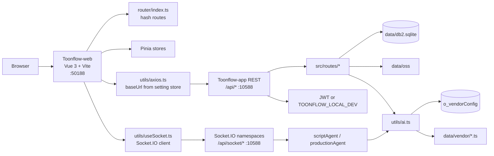
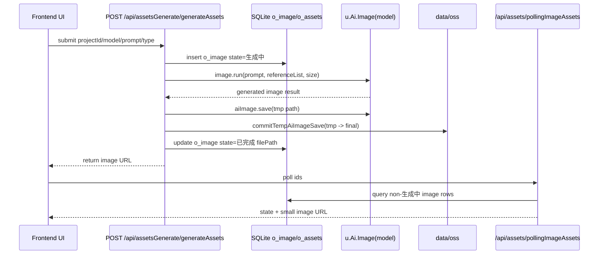
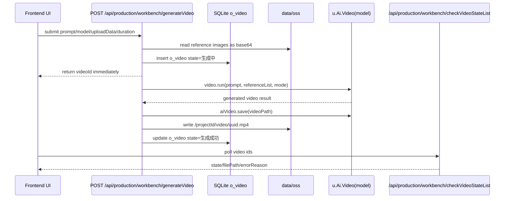
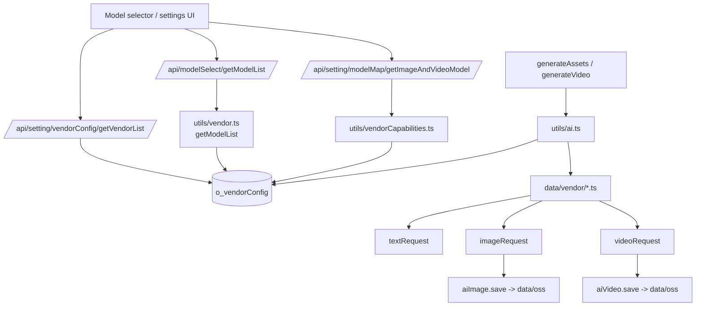
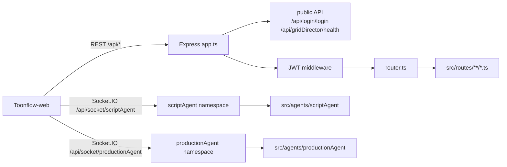

# Toonflow Project Architecture And API Map

任务编号：DOC-TOONFLOW-ARCHITECTURE-MAP-CLEANUP

本文档基于当前项目只读扫描结果整理，用于后续开发、排障和路由清理。本文档只描述当前真实结构，不代表目标架构。

## 1. 项目总览

当前 Toonflow 主应用由两个核心目录组成：

- `Toonflow-web`：前端应用，技术栈是 Vue 3 + Vite + TypeScript + Pinia。
- `Toonflow-app`：本地后端/API 服务，技术栈是 Express 5 + Socket.IO + SQLite。

需要明确：

- 当前主前端不是 React。
- 当前主后端不是 Python/FastAPI。
- `AI-repo/stable-diffusion-webui` 是旁路 Python 项目，不是 Toonflow 主服务入口，也不是当前 REST/Socket API 的提供者。

前端开发端口默认为 `50188`，后端开发端口默认为 `10588`。前端通过 `utils/axios.ts` 访问后端 REST API，通过 `utils/useSocket.ts` 连接后端 Socket.IO 命名空间。

## 2. 目录结构树

```text
BBBBBBBBBBBB/
├─ Toonflow-web/
│  ├─ src/
│  │  ├─ main.ts
│  │  ├─ App.vue
│  │  ├─ router/
│  │  │  └─ index.ts
│  │  ├─ stores/
│  │  ├─ utils/
│  │  │  ├─ axios.ts
│  │  │  ├─ useSocket.ts
│  │  │  ├─ localMode.ts
│  │  │  └─ videoPolling.ts
│  │  ├─ pages/
│  │  │  ├─ login/
│  │  │  ├─ workbench/
│  │  │  └─ error/
│  │  └─ views/
│  │     ├─ project/
│  │     ├─ novel/
│  │     ├─ script/
│  │     ├─ scriptAgent/
│  │     ├─ production/
│  │     ├─ assets/
│  │     ├─ cornerScape/
│  │     ├─ task/
│  │     └─ test/
│  ├─ package.json
│  ├─ vite.config.ts
│  ├─ tsconfig.json
│  ├─ tsconfig.app.json
│  ├─ tsconfig.node.json
│  ├─ .env.development
│  └─ .env.dev
├─ Toonflow-app/
│  ├─ src/
│  │  ├─ app.ts
│  │  ├─ router.ts
│  │  ├─ core.ts
│  │  ├─ env.ts
│  │  ├─ routes/
│  │  ├─ socket/
│  │  ├─ agents/
│  │  ├─ lib/
│  │  │  ├─ initDB.ts
│  │  │  └─ fixDB.ts
│  │  └─ utils/
│  │     ├─ ai.ts
│  │     ├─ vendor.ts
│  │     ├─ vendorCapabilities.ts
│  │     ├─ db.ts
│  │     ├─ oss.ts
│  │     ├─ getPath.ts
│  │     └─ taskRecord.ts
│  ├─ data/
│  │  ├─ db2.sqlite
│  │  ├─ vendor/
│  │  │  ├─ atlascloud.ts
│  │  │  ├─ deepseek.ts
│  │  │  ├─ grsai.ts
│  │  │  ├─ klingai.ts
│  │  │  ├─ minimax.ts
│  │  │  ├─ null.ts
│  │  │  ├─ openai.ts
│  │  │  ├─ third_party_api.ts
│  │  │  ├─ third_party_image_api.ts
│  │  │  ├─ third_party_video_api.ts
│  │  │  ├─ toonflow.ts
│  │  │  ├─ vidu.ts
│  │  │  └─ volcengine.ts
│  │  ├─ skills/
│  │  ├─ oss/
│  │  ├─ web/
│  │  ├─ models/
│  │  └─ modelPrompt/
│  ├─ package.json
│  └─ tsconfig.json
├─ AI-repo/
│  └─ stable-diffusion-webui/
├─ config/
│  └─ styles/
├─ docs-dev/
├─ tools/
│  └─ dev/
│     ├─ start-toonflow-dev.ps1
│     ├─ stop-toonflow-dev.ps1
│     ├─ check-toonflow-dev.ps1
│     └─ toonflow-dev-lib.ps1
└─ start-toonflow.bat
```

## 3. 前端运行链路

前端入口：

- `Toonflow-web/src/main.ts`
  - 创建 Vue app。
  - 注册 Pinia 和 `pinia-plugin-persistedstate`。
  - 注册 `vue-router`。
  - 注册 i18n。
  - 注册 TDesign、IconPark、图片优化插件。

路由：

- `Toonflow-web/src/router/index.ts`
  - 使用 `createWebHashHistory()`。
  - `/` 重定向到 `/workbench`，`/workbench` 再重定向到 `/project`。
  - 主页面包括 `/project`、`/task`、`/novel`、`/script`、`/scriptAgent`、`/cornerScape`、`/production`、`/assets`、`/test`。
  - `/login` 是登录页。
  - 非本地开发模式下，路由守卫依赖 `localStorage.token`。

状态管理：

- `Toonflow-web/src/stores/*`
  - `setting.ts` 保存 `baseUrl`，默认 `http://localhost:10588/api`。
  - `project.ts`、`scriptAgent.ts`、`productionAgent.ts`、`video.ts` 等保存业务状态。
  - 部分 store 使用持久化，本地缓存可能影响实际 baseUrl 和 UI 状态。

REST 调用层：

- `Toonflow-web/src/utils/axios.ts`
  - 创建 axios instance。
  - 每次请求从 `settingStore().baseUrl` 读取 REST baseURL。
  - 默认携带 `localStorage.token` 到 `Authorization` header。
  - 响应拦截器返回 `response.data`。
  - 401 时清 token 并跳转 `/login`，本地开发模式除外。

Socket 调用层：

- `Toonflow-web/src/utils/useSocket.ts`
  - 默认连接 `http://localhost:10588`。
  - 使用 Socket.IO，transports 为 `websocket` 和 `polling`。
  - 通过 `auth.token` 传 token。
  - 注意：Socket 默认 URL 不自动跟随 `setting.baseUrl`。

页面和视图：

- `pages/workbench/index.vue` 是主布局入口。
- `views/project` 管理项目。
- `views/novel` 管理小说和事件。
- `views/script` 管理剧本。
- `views/scriptAgent` 连接剧本 Agent。
- `views/production` 管理生产流、分镜、资产、视频工作台。
- `views/assets` 管理角色/场景/道具/音频资产。

## 4. 后端运行链路

后端入口：

- `Toonflow-app/src/app.ts`
  - 创建 Express app 和 HTTP server。
  - 创建 Socket.IO server。
  - 注册 `socketInit(io)`。
  - dev 模式下执行 `buildRoute()`。
  - 注册 CORS、JSON body、urlencoded body。
  - 挂载静态目录：
    - `/oss` -> `data/oss`
    - `/skills` -> `data/skills`，仅允许图片类扩展名
    - `/assets` -> `data/assets`
    - `data/web` -> 静态网站目录
  - 注册 JWT 鉴权中间件。
  - 动态 import `router.ts` 并挂载全部 REST 路由。
  - 默认端口 `10588`。

路由聚合：

- `Toonflow-app/src/router.ts`
  - 当前 REST 路由总表。
  - 所有业务 REST 路由统一挂载到 `/api/...`。
  - 文件由 `core.ts` 按 `src/routes/**/*.ts` 自动生成。

路由生成器：

- `Toonflow-app/src/core.ts`
  - 扫描 `src/routes/**/*.ts`。
  - 将文件路径转换为 REST path。
  - 写入 `src/router.ts`。
  - dev 启动时可能触发源码写入。

REST handlers：

- `Toonflow-app/src/routes/*`
  - 每个文件导出一个 Express router。
  - 大多数模块使用 `router.post("/")`。
  - 少量配置和健康检查使用 `router.get("/")`。

Socket：

- `Toonflow-app/src/socket/index.ts`
  - 注册 `/api/socket/scriptAgent`。
  - 注册 `/api/socket/productionAgent`。
- `src/socket/routes/scriptAgent.ts`
- `src/socket/routes/productionAgent.ts`
  - 校验 token 或本地开发模式。
  - 校验 `isolationKey`。
  - 处理 `chat`、`updateThinkConfig`、`stop` 等事件。

数据库：

- `Toonflow-app/src/utils/db.ts`
  - SQLite 文件为 `data/db2.sqlite`。
  - 使用 `knex` + `better-sqlite3`。
  - 启动时异步执行 `initDB(db)` 和 `fixDB(db)`。
  - dev 模式下会自动生成 `src/types/database.d.ts`。
- `Toonflow-app/src/lib/initDB.ts`
  - 创建 `o_user`、`o_project`、`o_assets`、`o_image`、`o_video`、`o_tasks`、`o_vendorConfig` 等表。
- `Toonflow-app/src/lib/fixDB.ts`
  - 运行补丁式数据修复和供应商配置修复。

AI 和模型：

- `Toonflow-app/src/utils/ai.ts`
  - 统一封装 Text/Image/Video/TTS 调用。
  - 根据 `vendorId:modelName` 找到供应商脚本和模型配置。
- `Toonflow-app/src/utils/vendor.ts`
  - 从 `o_vendorConfig.models` 读取模型列表。
- `Toonflow-app/src/utils/vendorCapabilities.ts`
  - 判断供应商是否支持 text/image/video。
  - 修复或过滤模型能力。
- `Toonflow-app/data/vendor/*.ts`
  - 每个供应商脚本需要导出 `vendor`、`textRequest`、`imageRequest`、`videoRequest`、`ttsRequest` 等能力函数。

文件落盘：

- `Toonflow-app/src/utils/oss.ts`
  - 统一把相对路径写入 `data/oss`。
  - 提供 `writeFile`、`getFile`、`getImageBase64`、`getFileUrl`、`getSmallImageUrl`。
  - dev 模式 URL 固定为 `http://localhost:10588/oss/...`。

## 5. REST API 路由总表

所有 REST API 统一挂载在 `/api` 下。以下路径均省略 `/api` 前缀。

### GET

```text
/gridDirector/health
/other/getVersion
/test/test
/setting/dbConfig/clearData
/setting/dbConfig/dbInfo
/setting/dbConfig/exportData
/setting/dev/getSwitchAiDevTool
/setting/agentDeploy/getAgentUseMode
/setting/loginConfig/getUser
/setting/memoryConfig/getMemory
/setting/modelMap/getPromptList
```

### POST

```text
/agents/clearMemory
/agents/getMemory

/artStyle/addArtStyle
/artStyle/editArtStyle
/artStyle/extractStylePrompt
/artStyle/getArtStyle

/assets/addAssets
/assets/addAudioAssets
/assets/batchDelete
/assets/batchGenerationData
/assets/delAssets
/assets/delImage
/assets/getAssetsApi
/assets/getImage
/assets/getMaterialData
/assets/pollingImageAssets
/assets/pollingPromptAssets
/assets/saveAssets
/assets/updateAssets
/assets/updateAudioAssets
/assets/uploadClip

/assetsGenerate/batchGenerateImageAssets
/assetsGenerate/batchPolishAssetsPrompt
/assetsGenerate/cancelGenerate
/assetsGenerate/generateAssets
/assetsGenerate/polishAssetsPrompt

/common/getBigImage

/cornerScape/batchBindAudio
/cornerScape/getAllAssets
/cornerScape/pollingAudio
/cornerScape/updateAssetsAudio

/general/generalStatistics
/general/getSingleProject
/general/updateProject

/login/login

/modelSelect/getModelDetail
/modelSelect/getModelList

/novel/addNovel
/novel/batchDeleteNovel
/novel/delNovel
/novel/event/batchDeleteEvent
/novel/event/deletEvent
/novel/event/generateEvents
/novel/event/getEvent
/novel/getNovel
/novel/getNovelData
/novel/getNovelEventState
/novel/getNovelIndex
/novel/updateNovel

/other/deleteAllData

/production/getFlowData
/production/getStoryboardData
/production/saveFlowData
/production/assets/batchGenerateAssetsImage
/production/assets/deleteAssetsDireve
/production/assets/pollingImage
/production/assets/updateAssetsUrl
/production/editImage/generateFlowImage
/production/editImage/getImageDefaultModle
/production/editImage/getImageFlow
/production/editImage/saveImageFlow
/production/editImage/updateImageFlow
/production/editImage/uploadImage
/production/storyboard/addStoryboard
/production/storyboard/batchAddStoryboardInfo
/production/storyboard/batchDelete
/production/storyboard/batchGenerateImage
/production/storyboard/downPreviewImage
/production/storyboard/editStoryboardInfo
/production/storyboard/getStoryboardData
/production/storyboard/pollingImage
/production/storyboard/previewImage
/production/storyboard/removeFrame
/production/storyboard/updateStoryboardUrl
/production/workbench/addTrack
/production/workbench/batchGeneratePrompt
/production/workbench/batchGenerateVideo
/production/workbench/checkVideoStateList
/production/workbench/deleteTrack
/production/workbench/delVideo
/production/workbench/generateVideo
/production/workbench/generateVideoPrompt
/production/workbench/getAudioBindAssetsList
/production/workbench/getFileUrl
/production/workbench/getGenerateData
/production/workbench/getVideoList
/production/workbench/selectVideo
/production/workbench/updateVideoDuration
/production/workbench/updateVideoPrompt

/project/addDirectorManual
/project/addProject
/project/addVisualManual
/project/deleteDirectorManual
/project/deleteVisualManual
/project/delProject
/project/editDirectorlManual
/project/editProject
/project/editVisualManual
/project/getModelDetails
/project/getProject
/project/getVisualManual
/project/queryDirectorManual
/project/visualManual

/script/addScript
/script/batchAddScript
/script/delScript
/script/exportScript
/script/extractAssets
/script/getAiRegex
/script/getScrptApi
/script/pollScriptAssets
/script/updateScript

/scriptAgent/getPlanData
/scriptAgent/setPlanData
/scriptAgent/updateData

/setting/about/checkUpdate
/setting/about/downloadApp
/setting/agentDeploy/agentSetKey
/setting/agentDeploy/deployAgentModel
/setting/agentDeploy/getAgentDeploy
/setting/agentDeploy/updateUseMode
/setting/dbConfig/clearTable
/setting/dbConfig/importData
/setting/dev/updateSwitchAiDevTool
/setting/fileManagement/openFolder
/setting/getTextModel
/setting/loginConfig/updateUserPwd
/setting/memoryConfig/delAllMemory
/setting/memoryConfig/sureMemory
/setting/modelMap/bindingPrompt
/setting/modelMap/deletePrompt
/setting/modelMap/getImageAndVideoModel
/setting/modelMap/savePrompt
/setting/modelMap/updatePrompt
/setting/promptManage/addPrompt
/setting/promptManage/applyPrompt
/setting/promptManage/copyPrompt
/setting/promptManage/deletePrompt
/setting/promptManage/getPrompt
/setting/promptManage/updatePrompt
/setting/skillManagement/getSkillContent
/setting/skillManagement/getSkillList
/setting/skillManagement/saveSkillContent
/setting/vendorConfig/addVendor
/setting/vendorConfig/addVendorModel
/setting/vendorConfig/clearVendorModels
/setting/vendorConfig/deleteVendor
/setting/vendorConfig/delVendorModel
/setting/vendorConfig/enableVendor
/setting/vendorConfig/fetchRemoteModels
/setting/vendorConfig/getCodeByLink
/setting/vendorConfig/getVendorList
/setting/vendorConfig/importVendorModels
/setting/vendorConfig/modelTest
/setting/vendorConfig/modelTest/imageTest
/setting/vendorConfig/modelTest/textTest
/setting/vendorConfig/modelTest/videoTest
/setting/vendorConfig/updateCode
/setting/vendorConfig/updateVendorInputs
/setting/vendorConfig/upVendorModel

/task/getProject
/task/getTaskApi
/task/getTaskCategories
/task/taskDetails
```

## 6. Socket.IO 路由

Socket.IO 命名空间：

```text
/api/socket/scriptAgent
/api/socket/productionAgent
```

`/api/socket/scriptAgent`：

- `chat`
- `updateThinkConfig`
- `stop`

`/api/socket/productionAgent`：

- `updateContext`
- `chat`
- `updateThinkConfig`
- `stop`

连接要求：

- 非本地开发模式下需要 `auth.token`。
- 两个命名空间都要求 `auth.isolationKey`。
- `productionAgent` 可通过 `updateContext` 更新 `isolationKey`、`projectId`、`scriptId`。

## 7. 图片生成链路

典型入口是资产图生成：

```text
前端点击生成
-> POST /api/assetsGenerate/generateAssets
-> 后端校验 projectId/model/resolution/id/type/name/prompt/base64
-> 查询 o_project 获取 artStyle/type/intro
-> 插入 o_image，state = 生成中
-> 更新 o_assets.imageId
-> 构造 relPathWithoutExt: /{projectId}/{role|scene|props}/{uuid}
-> u.Ai.Image(model).run(...)
-> aiImage.save("/{projectId}/{dir}/{uuid}.tmp")
-> commitTempAiImageSave(tempRelPath, relPathWithoutExt, ...)
-> 校验图片 buffer 和 magic bytes
-> 写入 data/oss/{projectId}/{dir}/{uuid}.{ext}
-> 删除临时 tmp
-> 更新 o_image，state = 已完成，filePath = 正式路径
-> u.oss.getSmallImageUrl(filePath)
-> 返回缩略图 URL
-> 前端通过 /api/assets/pollingImageAssets 轮询状态
```

状态流转：

```text
o_image.state:
生成中 -> 已完成
生成中 -> 生成失败
```

失败路径：

- `aiImage.run` 抛错。
- `aiImage.save` 未写出临时文件。
- `commitTempAiImageSave` 校验失败。
- 模型返回不是有效图片。
- 缩略图生成失败时会回退原图 URL，但不一定导致任务失败。

## 8. 视频生成链路

视频生成入口：

```text
POST /api/production/workbench/generateVideo
-> 校验 projectId/scriptId/uploadData/prompt/model/mode/resolution/duration/trackId
-> 查询 o_project.videoRatio
-> 生成 videoPath: /{projectId}/video/{uuid}.mp4
-> 根据 uploadData 查询 storyboard/assets 图片
-> u.oss.getImageBase64 转 base64 referenceList
-> 插入 o_video，state = 生成中，filePath = videoPath
-> 立即返回 videoId
-> 后台执行 u.Ai.Video(model).run(...)
-> aiVideo.save(videoPath)
-> 写入 data/oss/{projectId}/video/{uuid}.mp4
-> 更新 o_video.state = 生成成功
-> 前端通过 /api/production/workbench/checkVideoStateList 轮询
```

状态流转：

```text
o_video.state:
生成中 -> 生成成功
生成中 -> 生成失败
```

失败路径：

- 引用图片不存在或无法 base64。
- 供应商 `videoRequest` 抛错。
- 任务轮询超时。
- `aiVideo.save(videoPath)` 写入失败。

## 9. 模型服务链路

模型服务配置由数据库和 `data/vendor/*.ts` 共同驱动。

关键模块：

- `o_vendorConfig`
  - 保存供应商 id、enable 状态、输入配置、模型列表、脚本代码等。
- `Toonflow-app/data/vendor/*.ts`
  - 供应商脚本模板或实际供应商实现。
  - 典型文件包括 `openai.ts`、`third_party_image_api.ts`、`third_party_video_api.ts`、`atlascloud.ts`、`klingai.ts` 等。
- `src/routes/setting/vendorConfig/getVendorList.ts`
  - 返回供应商列表和模型列表。
- `src/routes/modelSelect/getModelList.ts`
  - 返回启用供应商的模型集合，可按 usage 过滤。
- `src/routes/setting/modelMap/getImageAndVideoModel.ts`
  - 获取可用于图片/视频的模型。
- `src/utils/vendor.ts`
  - `getModelList(id)` 从 `o_vendorConfig.models` 解析模型。
- `src/utils/vendorCapabilities.ts`
  - 识别 text/image/video 能力。
  - 修复文本-only 供应商的模型类型。
  - 格式化供应商能力错误。
- `src/utils/ai.ts`
  - 根据 `vendorId:modelName` 定位供应商。
  - 执行 `textRequest`、`imageRequest`、`videoRequest`、`ttsRequest`。

模型调用约定：

```text
前端选择模型
-> /api/modelSelect/getModelList 或 /api/setting/modelMap/getImageAndVideoModel
-> 返回 vendorId:modelName 形式的模型值
-> 生成路由调用 u.Ai.Image(model) 或 u.Ai.Video(model)
-> utils/ai.ts 拆分 vendorId 和 modelName
-> 读取 o_vendorConfig
-> 加载供应商脚本
-> 执行 imageRequest / videoRequest / textRequest
-> 返回 base64 或可保存结果
-> aiImage.save / aiVideo.save 写入 data/oss
```

## 10. 本地开发环境

默认端口：

- 前端 Vite：`50188`
- 后端 Express：`10588`

本地免登录变量：

- 后端：`TOONFLOW_LOCAL_DEV=1`
- 前端：`VITE_TOONFLOW_LOCAL_DEV=1`

前端环境文件当前包含：

```text
VITE_TOONFLOW_LOCAL_DEV=1
```

开发脚本：

- `tools/dev/start-toonflow-dev.ps1`
  - 检查并启动后端 `10588` 和前端 `50188`。
  - 默认向后端注入 `TOONFLOW_LOCAL_DEV=1`，除非传入 `-NoLocalDev`。
  - 可复用已有服务或重启。
- `tools/dev/stop-toonflow-dev.ps1`
  - 停止开发服务。
- `tools/dev/check-toonflow-dev.ps1`
  - 检查端口和健康状态。
- `tools/dev/toonflow-dev-lib.ps1`
  - 端口检查、健康检查、进程管理和日志工具函数。

Native ABI 风险：

- `Toonflow-app` 依赖 `better-sqlite3`、`sqlite3`、`sharp` 等 native 包。
- Node/Electron ABI、Windows 构建工具、缓存或 lockfile 不匹配时，后端可能启动失败。
- `package.json` 的 `engines.node` 当前为 `>=1.0.0`，不能真实约束运行环境。

## 11. 运行时写源码风险

只读扫描或只读审计任务不要启动后端。

原因：

- `NODE_ENV=dev` 时，`app.ts` 会执行 `buildRoute()`。
- `core.ts` 会扫描 `src/routes/**/*.ts` 并可能写入 `src/router.ts`。
- `utils/db.ts` 在 dev 模式下会调用 `initKnexType(db)`，可能写入 `src/types/database.d.ts`。

这两类行为属于运行时源码写入：

```text
src/core.ts -> src/router.ts
src/utils/db.ts -> src/types/database.d.ts
```

对 docs-only、只读扫描、CI 只读检查来说，应避免启动后端或执行会 import `src/app.ts` / `src/utils/db.ts` 的脚本。

## 12. Mermaid 图

### 前后端总链路图



### 图片生成链路图



### 视频生成链路图



### 模型服务到生成调用图



### REST 和 Socket 边界图



