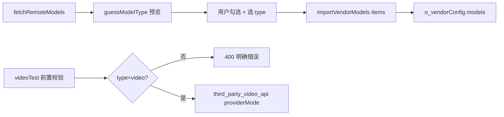

# 第三方视频 API 测试与模型导入修复地图

> 只读扫描结论（2026-05-20），对应任务：视频测试 404、模型类型错配、批量清理与导入预览。

## 1. 问题摘要

| 现象 | 根因 |
|------|------|
| `POST /task/jimeng/image2video` 404 | `third_party_video_api` 对非 Seedance 模型默认走即梦路径；`baseUrl` 为 `https://api.rcouyi.com/v1` 时 `taskRoot` 为 `https://api.rcouyi.com`，OpenAI-Compatible 网关通常无该私有路径 |
| `doubao-seedream-4-5-251128` 进视频测试 | 在**视频供应商**下远程拉取 `/models` 后，`mergeVendorModelIds` 按 **vendorId 固定 type=video** 写入，不按模型名分类 |
| 600 模型污染 | 拉取后曾可整批导入；现需预览 + 按 guessedType 勾选 |
| 清空不可用 | `clearVendorModels` 仅允许 `third_party_api` / `local_openai`，与前端 `CLEARABLE_VENDOR_IDS` 不一致 |

## 2. 文件职责与现状

### `Toonflow-app/data/vendor/third_party_video_api.ts`

- **硬编码路径**
  - Seedance：`POST {taskRoot}/task/volces/seedance`
  - 即梦：`POST {taskRoot}/task/jimeng/image2video` | `text2video`
  - 轮询：`GET {taskRoot}/task/{task_id}`
- **baseUrl 规则**：去掉尾部 `/v1` 得到 `taskRoot`
- **路由选择**：`isSeedanceModel` 仅匹配 `seedance` / `doubao-seedance`；**其余全部即梦**（含 `doubao-seedream-*`）
- **修复方向**：`providerMode`（auto/seedance/jimeng/custom/openai_compatible）、`submitPath`、`pollPathTemplate`；非 jimeng 禁止即梦路径；404 友好文案

### `Toonflow-app/data/vendor/third_party_api.ts`

- 文本专用；`imageRequest` throw；`videoRequest` 返回空（不参与视频测试）

### `Toonflow-app/src/routes/setting/vendorConfig/modelTest/videoTest.ts`

- 无 type / mode / durationResolutionMap / 供应商能力前置校验
- 直接 `u.Ai.Video(...).run`，404 才在 catch 中提示

### `Toonflow-app/src/routes/setting/vendorConfig/fetchRemoteModels.ts`

- 返回 `remoteModels: string[]` + `existingModelNames`
- **不**做类型猜测

### `Toonflow-app/src/routes/setting/vendorConfig/importVendorModels.ts`

- `mergeVendorModelIds(vendorId, modelIds)` → 按 vendor 默认 type 写库

### `Toonflow-app/src/utils/vendorModelStore.ts`

- `VENDOR_DEFAULT_MODEL_TYPE`：third_party_* 固定 text/image/video
- `toModelEntry` 忽略模型名语义

### `Toonflow-app/src/utils/vendor.ts`

- `getModelList`：文件模板 `vendor.models` + DB `o_vendorConfig.models` 按 `modelName` 合并

### `Toonflow-app/src/routes/setting/vendorConfig/clearVendorModels.ts`

- 仅 `third_party_api`、`local_openai`；全量清空 `models` JSON

### `Toonflow-web/.../vendorConfig.vue`

- 远程导入弹窗仅显示 ID；`clearVendorModels` 发 `vendorId`
- `handleTestModel` 仅按供应商维度限制 text/image/video，不校验单模型配置完整性

### `Toonflow-web/.../VideoModelTest.vue`

- 无打开前校验；模板内存在调试输出 `{{ selectedMode }}`

### `Toonflow-app/src/utils/ai.ts`

- 主调用链；本任务**不修改**（除非扫描证明必须）

## 3. 数据流（修复后目标）

## 4. 新增/变更 API

| 方法 | 路径 | 说明 |
|------|------|------|
| POST | `/api/setting/vendorConfig/clearVendorModels` | body: `{ id, type?: text\|image\|video\|tts\|all }`，保留 vendor 文件内置模型 |
| POST | `/api/setting/vendorConfig/fetchRemoteModels` | 增加 `preview[]`: modelId, guessedType, reason, defaultSelected |
| POST | `/api/setting/vendorConfig/importVendorModels` | 增加 `items: { modelId, type }[]`（与 modelIds 兼容） |

## 5. 验收要点

- seedream 拉取预览为 **image**，默认不勾选进视频供应商误导入
- 视频测试前拦截非 video / 缺配置 / 无 videoRequest
- OpenAI `/v1` + 即梦路径 → 明确配置错误，非裸 Invalid URL
- 批量按类型清空当前供应商 DB 模型

## 6. 禁止修改（本任务）

- `ai.ts` 主链、`productionAgent` / `scriptAgent`、`DB schema`、`package.json`
- `third_party_api` 文本逻辑
